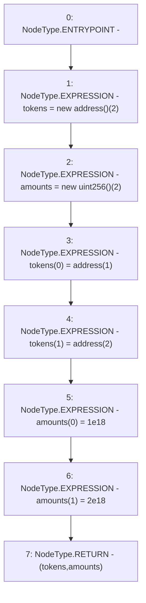

# Context: LiquityBaseTester.createCollExample

**Contract:** `LiquityBaseTester` (Inherits: LiquityBase, YetiCustomBase, BaseMath, ILiquityBase)
**Signature:** `createCollExample() returns (address[], uint256[])`
**Method Selector ID:** `0x6f675184`
**Visibility:** `external`
**Environment-Free:** `Yes`
**Modifiers:** None

### State Variables Interaction
- **Reads:** None
- **Writes:** None

### Environment & Verification Flags
- **Uses Foundry Cheatcodes:** No
- **Has Echidna Properties:** No

### Internal Calls Tree
- None

### External Calls / Value Transfers
- None

### Control Flow Graph (CFG)


### Source Mapping
Declared in: `certora-ac-datasets/detasets/web3bugs/dataset/web3bugs/66/packages/contracts/contracts/TestContracts/LiquityBaseTester.sol` on lines **24** to **31**

```solidity
    function createCollExample() external pure returns (address[] memory tokens, uint[] memory amounts) {
        tokens = new address[](2);
        amounts = new uint[](2);
        tokens[0] = address(1);
        tokens[1] = address(2);
        amounts[0] = 1e18;
        amounts[1] = 2e18;
    }

```
