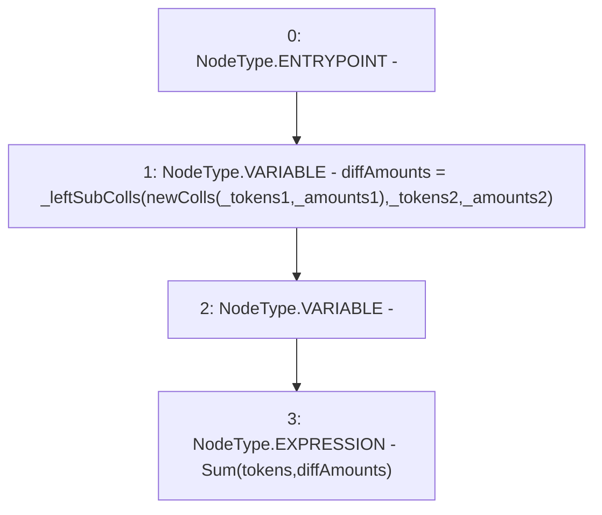

# Context: LiquityBaseTester.leftSubColls

**Contract:** `LiquityBaseTester` (Inherits: LiquityBase, YetiCustomBase, BaseMath, ILiquityBase)
**Signature:** `leftSubColls(address[],uint256[],address[],uint256[])`
**Method Selector ID:** `0x79eb52b5`
**Visibility:** `external`
**Environment-Free:** `Yes`
**Modifiers:** None

### State Variables Interaction
- **Reads:** None
- **Writes:** None

### Environment & Verification Flags
- **Uses Foundry Cheatcodes:** No
- **Has Echidna Properties:** No

### Internal Calls Tree
- None

### External Calls / Value Transfers
- None

### Control Flow Graph (CFG)


### Source Mapping
Declared in: `certora-ac-datasets/detasets/web3bugs/dataset/web3bugs/66/packages/contracts/contracts/TestContracts/LiquityBaseTester.sol` on lines **69** to **74**

```solidity
    function leftSubColls(address[] memory _tokens1, uint[] memory _amounts1,
        address[] memory _tokens2, uint[] memory _amounts2) external {
        uint[] memory diffAmounts = _leftSubColls(newColls(_tokens1, _amounts1), _tokens2, _amounts2);
        address[] memory tokens;
        emit Sum(tokens, diffAmounts);
    }

```
