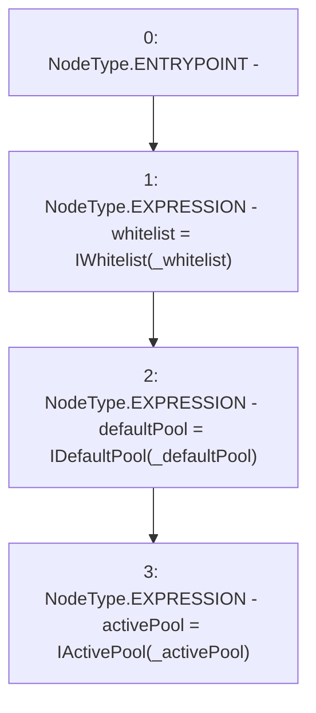

# Context: LiquityBaseTester.setAddresses

**Contract:** `LiquityBaseTester` (Inherits: LiquityBase, YetiCustomBase, BaseMath, ILiquityBase)
**Signature:** `setAddresses(address,address,address)`
**Method Selector ID:** `0x363bf964`
**Visibility:** `external`
**Environment-Free:** `Yes`
**Modifiers:** None

### State Variables Interaction
- **Reads:** None
- **Writes:** activePool, defaultPool, whitelist

### Environment & Verification Flags
- **Uses Foundry Cheatcodes:** No
- **Has Echidna Properties:** No

### Internal Calls Tree
- None

### External Calls / Value Transfers
- None

### Control Flow Graph (CFG)


### Source Mapping
Declared in: `certora-ac-datasets/detasets/web3bugs/dataset/web3bugs/66/packages/contracts/contracts/TestContracts/LiquityBaseTester.sol` on lines **13** to **17**

```solidity
    function setAddresses(address _whitelist, address _defaultPool, address _activePool) external {
        whitelist = IWhitelist(_whitelist);
        defaultPool = IDefaultPool(_defaultPool);
        activePool = IActivePool(_activePool);
    }

```
