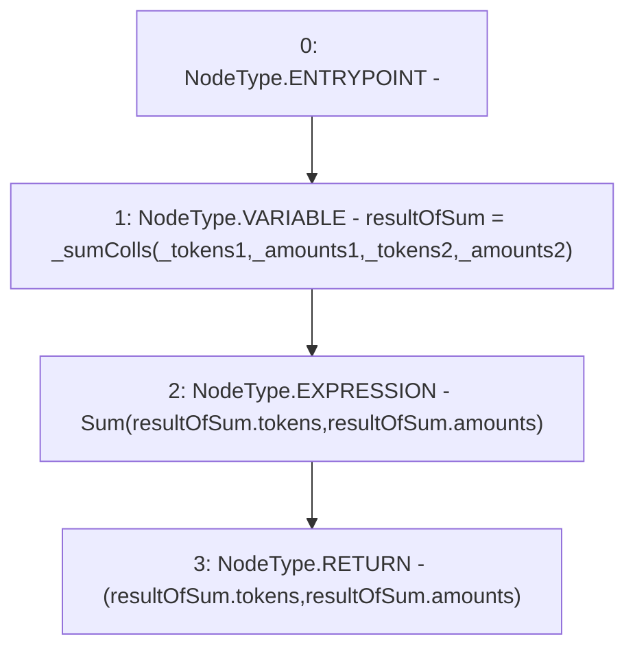

# Context: LiquityBaseTester.sumCollsTwoSplit

**Contract:** `LiquityBaseTester` (Inherits: LiquityBase, YetiCustomBase, BaseMath, ILiquityBase)
**Signature:** `sumCollsTwoSplit(address[],uint256[],address[],uint256[]) returns (address[], uint256[])`
**Method Selector ID:** `0x1f7b0200`
**Visibility:** `external`
**Environment-Free:** `Yes`
**Modifiers:** None

### State Variables Interaction
- **Reads:** None
- **Writes:** None

### Environment & Verification Flags
- **Uses Foundry Cheatcodes:** No
- **Has Echidna Properties:** No

### Internal Calls Tree
- None

### External Calls / Value Transfers
- None

### Control Flow Graph (CFG)


### Source Mapping
Declared in: `certora-ac-datasets/detasets/web3bugs/dataset/web3bugs/66/packages/contracts/contracts/TestContracts/LiquityBaseTester.sol` on lines **52** to **58**

```solidity
    function sumCollsTwoSplit(address[] memory _tokens1, uint[] memory _amounts1,
        address[] memory _tokens2, uint[] memory _amounts2) external returns
    (address[] memory, uint[] memory) {
        newColls memory resultOfSum = _sumColls(_tokens1, _amounts1, _tokens2, _amounts2);
        emit Sum(resultOfSum.tokens, resultOfSum.amounts);
        return (resultOfSum.tokens, resultOfSum.amounts);
    }

```
