# Context: LiquityBase._subColls

**Contract:** `LiquityBase` (Inherits: YetiCustomBase, BaseMath, ILiquityBase)
**Signature:** `_subColls(YetiCustomBase.newColls,address[],uint256[]) returns (YetiCustomBase.newColls)`
**Method Selector ID:** `Internal (No Method ID)`
**Visibility:** `internal`
**Environment-Free:** `Yes`
**Modifiers:** None

### State Variables Interaction
- **Reads:** whitelist
- **Writes:** None

### Assertion Checks & Business Requirements
- require/assert: `require(bool,string)(tokensLen == _amounts.length,SubColls invalid input)`
- require/assert: `require(bool,string)(coll3.amounts[tokenIndex] >= thisAmounts,illegal sub)`

### Environment & Verification Flags
- **Uses Foundry Cheatcodes:** No
- **Has Echidna Properties:** No

### Internal Calls Tree
- None

### External Calls / Value Transfers
- `IWhitelist.TMP_34(address[]) = HIGH_LEVEL_CALL, dest:whitelist(IWhitelist), function:getValidCollateral, arguments:[]  `
- `SafeMath.TMP_45(uint256) = LIBRARY_CALL, dest:SafeMath, function:SafeMath.sub(uint256,uint256), arguments:['REF_84', 'thisAmounts'] `
- `IWhitelist.TMP_39(uint256) = HIGH_LEVEL_CALL, dest:whitelist(IWhitelist), function:getIndex, arguments:['REF_71']  `
- `IWhitelist.TMP_42(uint256) = HIGH_LEVEL_CALL, dest:whitelist(IWhitelist), function:getIndex, arguments:['REF_77']  `

### Control Flow Graph (CFG)

```mermaid
flowchart TD
    Node_0["0: NodeType.ENTRYPOINT - "]
    Node_0 --> Node_1
    Node_1["1: NodeType.VARIABLE - coll1Len = _coll1.tokens.length"]
    Node_1 --> Node_2
    Node_2["2: NodeType.VARIABLE - tokensLen = _tokens.length"]
    Node_2 --> Node_3
    Node_3["3: NodeType.EXPRESSION - require(bool,string)(tokensLen == _amounts.length,SubColls invalid input)"]
    Node_3 --> Node_4
    Node_4["4: NodeType.VARIABLE - "]
    Node_4 --> Node_5
    Node_5["5: NodeType.EXPRESSION - coll3.tokens = whitelist.getValidCollateral()"]
    Node_5 --> Node_6
    Node_6["6: NodeType.VARIABLE - coll3Len = coll3.tokens.length"]
    Node_6 --> Node_7
    Node_7["7: NodeType.EXPRESSION - coll3.amounts = new uint256()(coll3Len)"]
    Node_7 --> Node_8
    Node_8["8: NodeType.VARIABLE - n = 0"]
    Node_8 --> Node_9
    Node_9["9: NodeType.VARIABLE - "]
    Node_9 --> Node_10
    Node_10["10: NodeType.VARIABLE - "]
    Node_10 --> Node_11
    Node_11["11: NodeType.STARTLOOP - "]
    Node_11 --> Node_13
    Node_12["12: NodeType.ENDLOOP - "]
    Node_12 --> Node_20
    Node_13["13: NodeType.IFLOOP - i < coll1Len"]
    Node_13 --> Node_14
    Node_13 --> Node_12
    Node_14["14: NodeType.IF - _coll1.amounts(i) != 0"]
    Node_14 --> Node_15
    Node_14 --> Node_18
    Node_15["15: NodeType.EXPRESSION - tokenIndex = whitelist.getIndex(_coll1.tokens(i))"]
    Node_15 --> Node_16
    Node_16["16: NodeType.EXPRESSION - coll3.amounts(tokenIndex) = _coll1.amounts(i)"]
    Node_16 --> Node_17
    Node_17["17: NodeType.EXPRESSION - n ++"]
    Node_17 --> Node_18
    Node_18["18: NodeType.ENDIF - "]
    Node_18 --> Node_19
    Node_19["19: NodeType.EXPRESSION - ++ i"]
    Node_19 --> Node_13
    Node_20["20: NodeType.VARIABLE - "]
    Node_20 --> Node_21
    Node_21["21: NodeType.EXPRESSION - tokenIndex = 0"]
    Node_21 --> Node_22
    Node_22["22: NodeType.EXPRESSION - i = 0"]
    Node_22 --> Node_23
    Node_23["23: NodeType.STARTLOOP - "]
    Node_23 --> Node_25
    Node_24["24: NodeType.ENDLOOP - "]
    Node_24 --> Node_34
    Node_25["25: NodeType.IFLOOP - i < tokensLen"]
    Node_25 --> Node_26
    Node_25 --> Node_24
    Node_26["26: NodeType.EXPRESSION - tokenIndex = whitelist.getIndex(_tokens(i))"]
    Node_26 --> Node_27
    Node_27["27: NodeType.EXPRESSION - thisAmounts = _amounts(i)"]
    Node_27 --> Node_28
    Node_28["28: NodeType.EXPRESSION - require(bool,string)(coll3.amounts(tokenIndex) >= thisAmounts,illegal sub)"]
    Node_28 --> Node_29
    Node_29["29: NodeType.EXPRESSION - coll3.amounts(tokenIndex) = coll3.amounts(tokenIndex).sub(thisAmounts)"]
    Node_29 --> Node_30
    Node_30["30: NodeType.IF - coll3.amounts(tokenIndex) == 0"]
    Node_30 --> Node_31
    Node_30 --> Node_32
    Node_31["31: NodeType.EXPRESSION - n --"]
    Node_31 --> Node_32
    Node_32["32: NodeType.ENDIF - "]
    Node_32 --> Node_33
    Node_33["33: NodeType.EXPRESSION - ++ i"]
    Node_33 --> Node_25
    Node_34["34: NodeType.VARIABLE - diffTokens = new address()(n)"]
    Node_34 --> Node_35
    Node_35["35: NodeType.VARIABLE - diffAmounts = new uint256()(n)"]
    Node_35 --> Node_36
    Node_36["36: NodeType.IF - n != 0"]
    Node_36 --> Node_37
    Node_36 --> Node_48
    Node_37["37: NodeType.VARIABLE - "]
    Node_37 --> Node_38
    Node_38["38: NodeType.EXPRESSION - i = 0"]
    Node_38 --> Node_39
    Node_39["39: NodeType.STARTLOOP - "]
    Node_39 --> Node_41
    Node_40["40: NodeType.ENDLOOP - "]
    Node_40 --> Node_48
    Node_41["41: NodeType.IFLOOP - i < coll3Len"]
    Node_41 --> Node_42
    Node_41 --> Node_40
    Node_42["42: NodeType.IF - coll3.amounts(i) != 0"]
    Node_42 --> Node_43
    Node_42 --> Node_46
    Node_43["43: NodeType.EXPRESSION - diffTokens(j) = coll3.tokens(i)"]
    Node_43 --> Node_44
    Node_44["44: NodeType.EXPRESSION - diffAmounts(j) = coll3.amounts(i)"]
    Node_44 --> Node_45
    Node_45["45: NodeType.EXPRESSION - ++ j"]
    Node_45 --> Node_46
    Node_46["46: NodeType.ENDIF - "]
    Node_46 --> Node_47
    Node_47["47: NodeType.EXPRESSION - ++ i"]
    Node_47 --> Node_41
    Node_48["48: NodeType.ENDIF - "]
    Node_48 --> Node_49
    Node_49["49: NodeType.EXPRESSION - finalColls.tokens = diffTokens"]
    Node_49 --> Node_50
    Node_50["50: NodeType.EXPRESSION - finalColls.amounts = diffAmounts"]
    Node_50 --> Node_51
    Node_51["51: NodeType.RETURN - finalColls"]
```


### Source Mapping
Declared in: `certora-ac-datasets/detasets/web3bugs/dataset/web3bugs/66/packages/contracts/contracts/Dependencies/YetiCustomBase.sol` on lines **137** to **190**

```solidity
    function _subColls(newColls memory _coll1, address[] memory _tokens, uint[] memory _amounts)
        internal
        view
        returns (newColls memory finalColls)
    {
        uint256 coll1Len = _coll1.tokens.length;
        uint256 tokensLen = _tokens.length;
        require(tokensLen == _amounts.length, "SubColls invalid input");

        newColls memory coll3;
        coll3.tokens = whitelist.getValidCollateral();
        uint256 coll3Len = coll3.tokens.length;
        coll3.amounts = new uint256[](coll3Len);
        uint256 n = 0;
        uint256 tokenIndex;
        uint256 i;
        for (; i < coll1Len; ++i) {
            if (_coll1.amounts[i] != 0) {
                tokenIndex = whitelist.getIndex(_coll1.tokens[i]);
                coll3.amounts[tokenIndex] = _coll1.amounts[i];
                n++;
            }
        }
        uint256 thisAmounts;
        tokenIndex = 0;
        i = 0;
        for (; i < tokensLen; ++i) {
            tokenIndex = whitelist.getIndex(_tokens[i]);
            thisAmounts = _amounts[i];
            require(coll3.amounts[tokenIndex] >= thisAmounts, "illegal sub");
            coll3.amounts[tokenIndex] = coll3.amounts[tokenIndex].sub(thisAmounts);
            if (coll3.amounts[tokenIndex] == 0) {
                n--;
            }
        }

        address[] memory diffTokens = new address[](n);
        uint256[] memory diffAmounts = new uint256[](n);
        
        if (n != 0) {
            uint j;
            i = 0;
            for (; i < coll3Len; ++i) {
                if (coll3.amounts[i] != 0) {
                    diffTokens[j] = coll3.tokens[i];
                    diffAmounts[j] = coll3.amounts[i];
                    ++j;
                }
            }
        }
        finalColls.tokens = diffTokens;
        finalColls.amounts = diffAmounts;
        // returns finalColls;
    }

```
