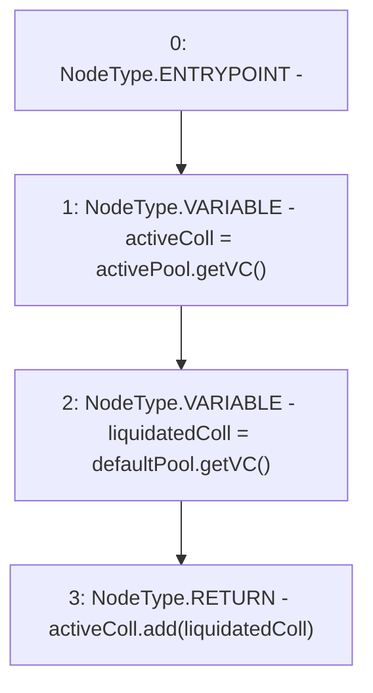

# Context: LiquityBase.getEntireSystemColl

**Contract:** `LiquityBase` (Inherits: YetiCustomBase, BaseMath, ILiquityBase)
**Signature:** `getEntireSystemColl() returns (uint256)`
**Method Selector ID:** `0x887105d3`
**Visibility:** `public`
**Environment-Free:** `Yes`
**Modifiers:** None

### State Variables Interaction
- **Reads:** activePool, defaultPool
- **Writes:** None

### Environment & Verification Flags
- **Uses Foundry Cheatcodes:** No
- **Has Echidna Properties:** No

### Internal Calls Tree
- None

### External Calls / Value Transfers
- `SafeMath.TMP_62(uint256) = LIBRARY_CALL, dest:SafeMath, function:SafeMath.add(uint256,uint256), arguments:['activeColl', 'liquidatedColl'] `
- `IDefaultPool.TMP_61(uint256) = HIGH_LEVEL_CALL, dest:defaultPool(IDefaultPool), function:getVC, arguments:[]  `
- `IActivePool.TMP_60(uint256) = HIGH_LEVEL_CALL, dest:activePool(IActivePool), function:getVC, arguments:[]  `

### Control Flow Graph (CFG)


### Source Mapping
Declared in: `certora-ac-datasets/detasets/web3bugs/dataset/web3bugs/66/packages/contracts/contracts/Dependencies/LiquityBase.sol` on lines **61** to **66**

```solidity
    function getEntireSystemColl() public view returns (uint) {
        uint activeColl = activePool.getVC();
        uint liquidatedColl = defaultPool.getVC();

        return activeColl.add(liquidatedColl);
    }

```
