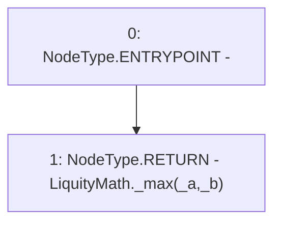

# Context: LiquityMathTester.callMax

**Contract:** `LiquityMathTester` (Inherits: None)
**Signature:** `callMax(uint256,uint256) returns (uint256)`
**Method Selector ID:** `0x36090b01`
**Visibility:** `external`
**Environment-Free:** `Yes`
**Modifiers:** None

### State Variables Interaction
- **Reads:** None
- **Writes:** None

### Environment & Verification Flags
- **Uses Foundry Cheatcodes:** No
- **Has Echidna Properties:** No

### Internal Calls Tree
- None

### External Calls / Value Transfers
- `LiquityMath.TMP_45(uint256) = LIBRARY_CALL, dest:LiquityMath, function:LiquityMath._max(uint256,uint256), arguments:['_a', '_b'] `

### Control Flow Graph (CFG)


### Source Mapping
Declared in: `certora-ac-datasets/detasets/web3bugs/dataset/web3bugs/66/packages/contracts/contracts/TestContracts/LiquityMathTester.sol` on lines **11** to **13**

```solidity
    function callMax(uint _a, uint _b) external pure returns (uint) {
        return LiquityMath._max(_a, _b);
    }

```
