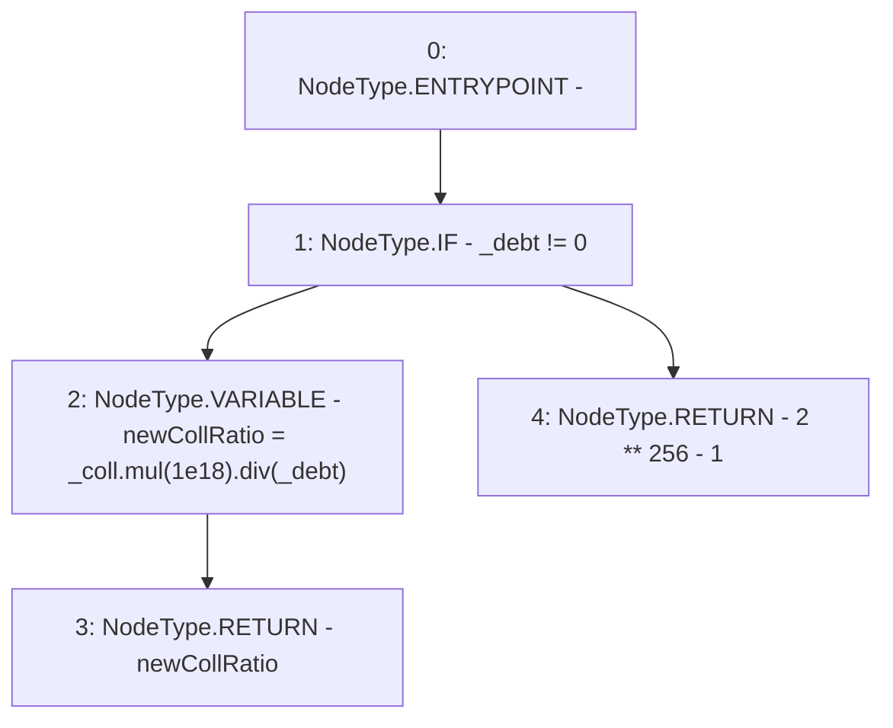

# Context: LiquityMath._computeCR

**Contract:** `LiquityMath` (Inherits: None)
**Signature:** `_computeCR(uint256,uint256) returns (uint256)`
**Method Selector ID:** `Internal (No Method ID)`
**Visibility:** `internal`
**Environment-Free:** `Yes`
**Modifiers:** None

### State Variables Interaction
- **Reads:** None
- **Writes:** None

### Environment & Verification Flags
- **Uses Foundry Cheatcodes:** No
- **Has Echidna Properties:** No

### Internal Calls Tree
- None

### External Calls / Value Transfers
- `SafeMath.TMP_631(uint256) = LIBRARY_CALL, dest:SafeMath, function:SafeMath.mul(uint256,uint256), arguments:['_coll', '1000000000000000000'] `
- `SafeMath.TMP_632(uint256) = LIBRARY_CALL, dest:SafeMath, function:SafeMath.div(uint256,uint256), arguments:['TMP_631', '_debt'] `

### Control Flow Graph (CFG)


### Source Mapping
Declared in: `certora-ac-datasets/detasets/web3bugs/dataset/web3bugs/66/packages/contracts/contracts/Dependencies/LiquityMath.sol` on lines **83** to **92**

```solidity
    function _computeCR(uint _coll, uint _debt) internal pure returns (uint) {
        if (_debt != 0) {
            uint newCollRatio = _coll.mul(1e18).div(_debt);
            return newCollRatio;
        }
        // Return the maximal value for uint256 if the Trove has a debt of 0. Represents "infinite" CR.
        else { // if (_debt == 0)
            return 2**256 - 1; 
        }
    }

```
