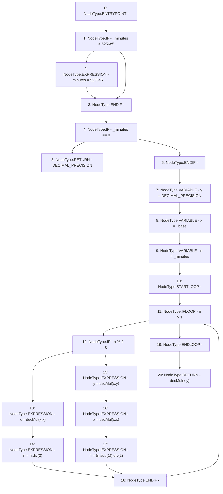

# Context: LiquityMath._decPow

**Contract:** `LiquityMath` (Inherits: None)
**Signature:** `_decPow(uint256,uint256) returns (uint256)`
**Method Selector ID:** `Internal (No Method ID)`
**Visibility:** `internal`
**Environment-Free:** `Yes`
**Modifiers:** None

### State Variables Interaction
- **Reads:** DECIMAL_PRECISION
- **Writes:** None

### Environment & Verification Flags
- **Uses Foundry Cheatcodes:** No
- **Has Echidna Properties:** No

### Internal Calls Tree
- None

### External Calls / Value Transfers
- `SafeMath.TMP_624(uint256) = LIBRARY_CALL, dest:SafeMath, function:SafeMath.sub(uint256,uint256), arguments:['n', '1'] `
- `SafeMath.TMP_625(uint256) = LIBRARY_CALL, dest:SafeMath, function:SafeMath.div(uint256,uint256), arguments:['TMP_624', '2'] `
- `SafeMath.TMP_621(uint256) = LIBRARY_CALL, dest:SafeMath, function:SafeMath.div(uint256,uint256), arguments:['n', '2'] `

### Control Flow Graph (CFG)


### Source Mapping
Declared in: `certora-ac-datasets/detasets/web3bugs/dataset/web3bugs/66/packages/contracts/contracts/Dependencies/LiquityMath.sol` on lines **52** to **75**

```solidity
    function _decPow(uint _base, uint _minutes) internal pure returns (uint) {
       
        if (_minutes > 5256e5) {_minutes = 5256e5;}  // cap to avoid overflow
    
        if (_minutes == 0) {return DECIMAL_PRECISION;}

        uint y = DECIMAL_PRECISION;
        uint x = _base;
        uint n = _minutes;

        // Exponentiation-by-squaring
        while (n > 1) {
            if (n % 2 == 0) {
                x = decMul(x, x);
                n = n.div(2);
            } else { // if (n % 2 != 0)
                y = decMul(x, y);
                x = decMul(x, x);
                n = (n.sub(1)).div(2);
            }
        }

        return decMul(x, y);
  }

```
