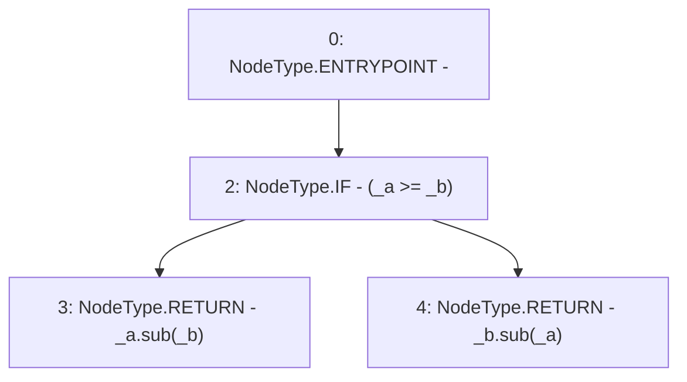

# Context: LiquityMath._getAbsoluteDifference

**Contract:** `LiquityMath` (Inherits: None)
**Signature:** `_getAbsoluteDifference(uint256,uint256) returns (uint256)`
**Method Selector ID:** `Internal (No Method ID)`
**Visibility:** `internal`
**Environment-Free:** `Yes`
**Modifiers:** None

### State Variables Interaction
- **Reads:** None
- **Writes:** None

### Environment & Verification Flags
- **Uses Foundry Cheatcodes:** No
- **Has Echidna Properties:** No

### Internal Calls Tree
- None

### External Calls / Value Transfers
- `SafeMath.TMP_629(uint256) = LIBRARY_CALL, dest:SafeMath, function:SafeMath.sub(uint256,uint256), arguments:['_b', '_a'] `
- `SafeMath.TMP_628(uint256) = LIBRARY_CALL, dest:SafeMath, function:SafeMath.sub(uint256,uint256), arguments:['_a', '_b'] `

### Control Flow Graph (CFG)


### Source Mapping
Declared in: `certora-ac-datasets/detasets/web3bugs/dataset/web3bugs/66/packages/contracts/contracts/Dependencies/LiquityMath.sol` on lines **77** to **79**

```solidity
    function _getAbsoluteDifference(uint _a, uint _b) internal pure returns (uint) {
        return (_a >= _b) ? _a.sub(_b) : _b.sub(_a);
    }

```
