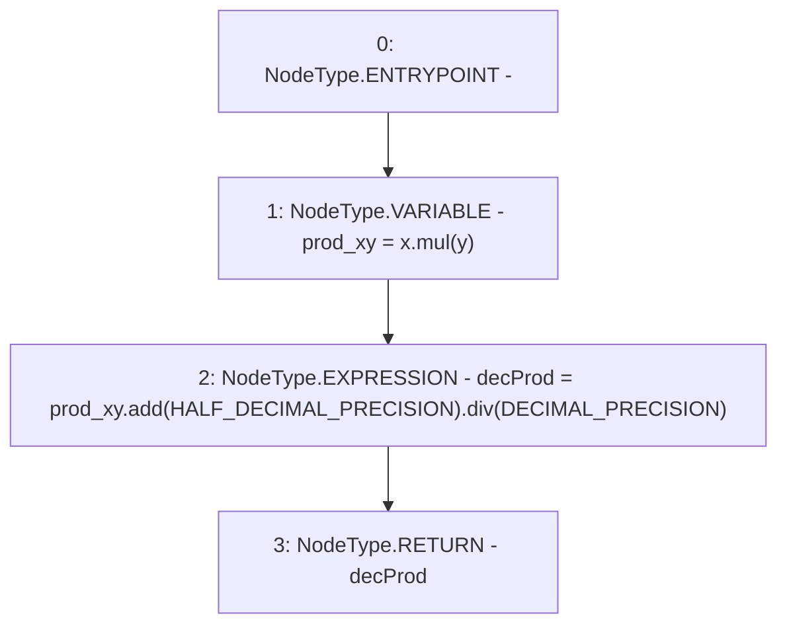

# Context: LiquityMath.decMul

**Contract:** `LiquityMath` (Inherits: None)
**Signature:** `decMul(uint256,uint256) returns (uint256)`
**Method Selector ID:** `Internal (No Method ID)`
**Visibility:** `internal`
**Environment-Free:** `Yes`
**Modifiers:** None

### State Variables Interaction
- **Reads:** DECIMAL_PRECISION, HALF_DECIMAL_PRECISION
- **Writes:** None

### Environment & Verification Flags
- **Uses Foundry Cheatcodes:** No
- **Has Echidna Properties:** No

### Internal Calls Tree
- None

### External Calls / Value Transfers
- `SafeMath.TMP_614(uint256) = LIBRARY_CALL, dest:SafeMath, function:SafeMath.div(uint256,uint256), arguments:['TMP_613', 'DECIMAL_PRECISION'] `
- `SafeMath.TMP_613(uint256) = LIBRARY_CALL, dest:SafeMath, function:SafeMath.add(uint256,uint256), arguments:['prod_xy', 'HALF_DECIMAL_PRECISION'] `
- `SafeMath.TMP_612(uint256) = LIBRARY_CALL, dest:SafeMath, function:SafeMath.mul(uint256,uint256), arguments:['x', 'y'] `

### Control Flow Graph (CFG)


### Source Mapping
Declared in: `certora-ac-datasets/detasets/web3bugs/dataset/web3bugs/66/packages/contracts/contracts/Dependencies/LiquityMath.sol` on lines **28** to **32**

```solidity
    function decMul(uint x, uint y) internal pure returns (uint decProd) {
        uint prod_xy = x.mul(y);

        decProd = prod_xy.add(HALF_DECIMAL_PRECISION).div(DECIMAL_PRECISION);
    }

```
