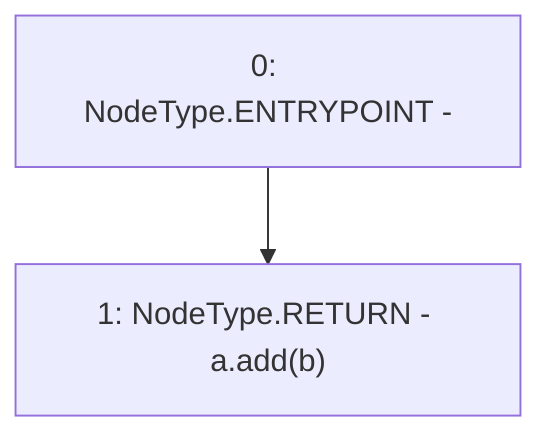

# Context: LiquitySafeMath128Tester.add

**Contract:** `LiquitySafeMath128Tester` (Inherits: None)
**Signature:** `add(uint128,uint128) returns (uint128)`
**Method Selector ID:** `0xfeb99390`
**Visibility:** `external`
**Environment-Free:** `Yes`
**Modifiers:** None

### State Variables Interaction
- **Reads:** None
- **Writes:** None

### Environment & Verification Flags
- **Uses Foundry Cheatcodes:** No
- **Has Echidna Properties:** No

### Internal Calls Tree
- None

### External Calls / Value Transfers
- `LiquitySafeMath128.TMP_6(uint128) = LIBRARY_CALL, dest:LiquitySafeMath128, function:LiquitySafeMath128.add(uint128,uint128), arguments:['a', 'b'] `

### Control Flow Graph (CFG)


### Source Mapping
Declared in: `certora-ac-datasets/detasets/web3bugs/dataset/web3bugs/66/packages/contracts/contracts/TestContracts/LiquitySafeMath128Tester.sol` on lines **12** to **14**

```solidity
    function add(uint128 a, uint128 b) external pure returns (uint128) {
        return a.add(b);
    }

```
