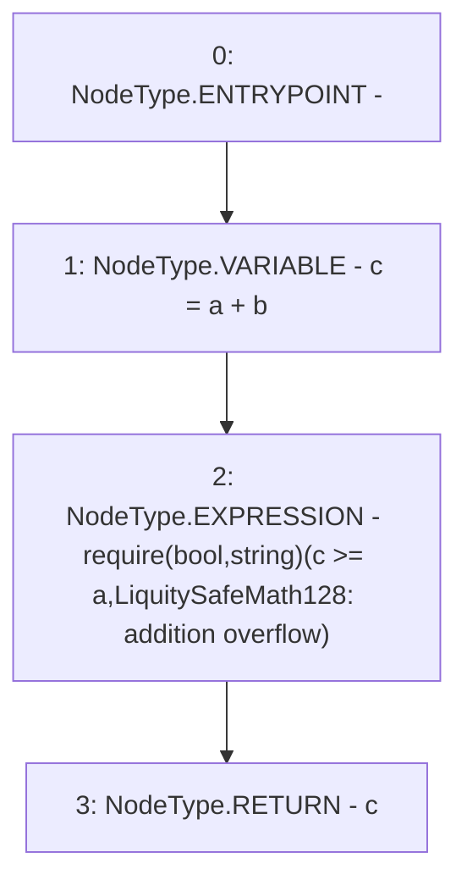

# Context: LiquitySafeMath128.add

**Contract:** `LiquitySafeMath128` (Inherits: None)
**Signature:** `add(uint128,uint128) returns (uint128)`
**Method Selector ID:** `Internal (No Method ID)`
**Visibility:** `internal`
**Environment-Free:** `Yes`
**Modifiers:** None

### State Variables Interaction
- **Reads:** None
- **Writes:** None

### Assertion Checks & Business Requirements
- require/assert: `require(bool,string)(c >= a,LiquitySafeMath128: addition overflow)`

### Environment & Verification Flags
- **Uses Foundry Cheatcodes:** No
- **Has Echidna Properties:** No

### Internal Calls Tree
- None

### External Calls / Value Transfers
- None

### Control Flow Graph (CFG)


### Source Mapping
Declared in: `certora-ac-datasets/detasets/web3bugs/dataset/web3bugs/66/packages/contracts/contracts/Dependencies/LiquitySafeMath128.sol` on lines **8** to **13**

```solidity
    function add(uint128 a, uint128 b) internal pure returns (uint128) {
        uint128 c = a + b;
        require(c >= a, "LiquitySafeMath128: addition overflow");

        return c;
    }

```
