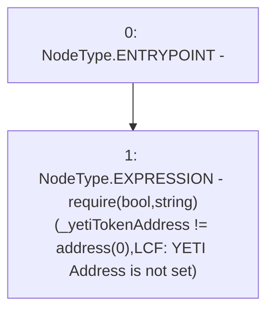

# Context: LockupContractFactory._requireYETIAddressIsSet

**Contract:** `LockupContractFactory` (Inherits: CheckContract, Ownable, ILockupContractFactory)
**Signature:** `_requireYETIAddressIsSet(address)`
**Method Selector ID:** `Internal (No Method ID)`
**Visibility:** `internal`
**Environment-Free:** `Yes`
**Modifiers:** None

### State Variables Interaction
- **Reads:** None
- **Writes:** None

### Assertion Checks & Business Requirements
- require/assert: `require(bool,string)(_yetiTokenAddress != address(0),LCF: YETI Address is not set)`

### Environment & Verification Flags
- **Uses Foundry Cheatcodes:** No
- **Has Echidna Properties:** No

### Internal Calls Tree
- None

### External Calls / Value Transfers
- None

### Control Flow Graph (CFG)


### Source Mapping
Declared in: `certora-ac-datasets/detasets/web3bugs/dataset/web3bugs/66/packages/contracts/contracts/YETI/LockupContractFactory.sol` on lines **70** to **72**

```solidity
    function _requireYETIAddressIsSet(address _yetiTokenAddress) internal pure {
        require(_yetiTokenAddress != address(0), "LCF: YETI Address is not set");
    }

```
