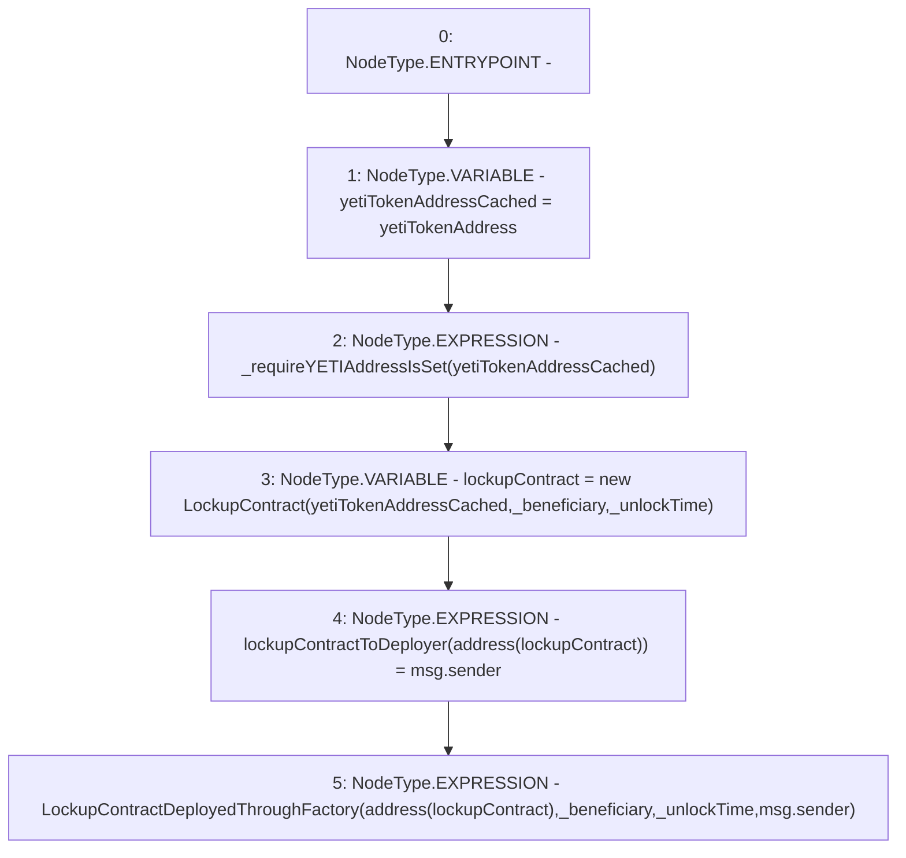

# Context: LockupContractFactory.deployLockupContract

**Contract:** `LockupContractFactory` (Inherits: CheckContract, Ownable, ILockupContractFactory)
**Signature:** `deployLockupContract(address,uint256)`
**Method Selector ID:** `0x34c44b4d`
**Visibility:** `external`
**Environment-Free:** `No (reads EVM state context)`
**Modifiers:** None

### State Variables Interaction
- **Reads:** yetiTokenAddress
- **Writes:** lockupContractToDeployer

### Environment & Verification Flags
- **Uses Foundry Cheatcodes:** No
- **Has Echidna Properties:** No

### Internal Calls Tree
- None

### External Calls / Value Transfers
- None

### Control Flow Graph (CFG)


### Source Mapping
Declared in: `certora-ac-datasets/detasets/web3bugs/dataset/web3bugs/66/packages/contracts/contracts/YETI/LockupContractFactory.sol` on lines **53** to **63**

```solidity
    function deployLockupContract(address _beneficiary, uint _unlockTime) external override {
        address yetiTokenAddressCached = yetiTokenAddress;
        _requireYETIAddressIsSet(yetiTokenAddressCached);
        LockupContract lockupContract = new LockupContract(
                                                        yetiTokenAddressCached,
                                                        _beneficiary, 
                                                        _unlockTime);

        lockupContractToDeployer[address(lockupContract)] = msg.sender;
        emit LockupContractDeployedThroughFactory(address(lockupContract), _beneficiary, _unlockTime, msg.sender);
    }

```
