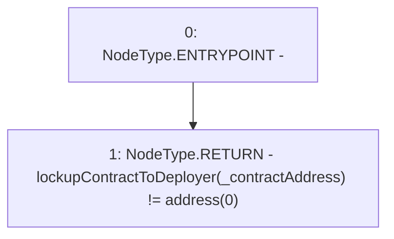

# Context: LockupContractFactory.isRegisteredLockup

**Contract:** `LockupContractFactory` (Inherits: CheckContract, Ownable, ILockupContractFactory)
**Signature:** `isRegisteredLockup(address) returns (bool)`
**Method Selector ID:** `0xbb7603f1`
**Visibility:** `public`
**Environment-Free:** `Yes`
**Modifiers:** None

### State Variables Interaction
- **Reads:** lockupContractToDeployer
- **Writes:** None

### Environment & Verification Flags
- **Uses Foundry Cheatcodes:** No
- **Has Echidna Properties:** No

### Internal Calls Tree
- None

### External Calls / Value Transfers
- None

### Control Flow Graph (CFG)


### Source Mapping
Declared in: `certora-ac-datasets/detasets/web3bugs/dataset/web3bugs/66/packages/contracts/contracts/YETI/LockupContractFactory.sol` on lines **65** to **67**

```solidity
    function isRegisteredLockup(address _contractAddress) public view override returns (bool) {
        return lockupContractToDeployer[_contractAddress] != address(0);
    }

```
