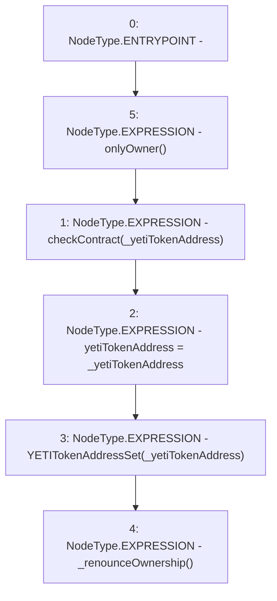

# Context: LockupContractFactory.setYETITokenAddress

**Contract:** `LockupContractFactory` (Inherits: CheckContract, Ownable, ILockupContractFactory)
**Signature:** `setYETITokenAddress(address)`
**Method Selector ID:** `0x0d3e21f8`
**Visibility:** `external`
**Environment-Free:** `No (reads EVM state context)`
**Modifiers:**
- `onlyOwner`
  ```solidity
  modifier onlyOwner() {
          require(isOwner(), "CallerNotOwner");
          _;
      }
  ```

### State Variables Interaction
- **Reads:** None
- **Writes:** yetiTokenAddress

### Environment & Verification Flags
- **Uses Foundry Cheatcodes:** No
- **Has Echidna Properties:** No

### Internal Calls Tree
- None

### External Calls / Value Transfers
- None

### Control Flow Graph (CFG)


### Source Mapping
Declared in: `certora-ac-datasets/detasets/web3bugs/dataset/web3bugs/66/packages/contracts/contracts/YETI/LockupContractFactory.sol` on lines **44** to **51**

```solidity
    function setYETITokenAddress(address _yetiTokenAddress) external override onlyOwner {
        checkContract(_yetiTokenAddress);

        yetiTokenAddress = _yetiTokenAddress;
        emit YETITokenAddressSet(_yetiTokenAddress);

        _renounceOwnership();
    }

```
