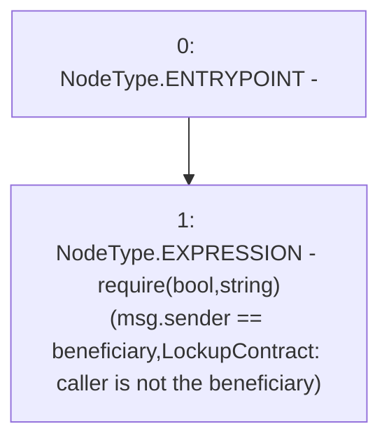

# Context: LockupContract._requireCallerIsBeneficiary

**Contract:** `LockupContract` (Inherits: None)
**Signature:** `_requireCallerIsBeneficiary()`
**Method Selector ID:** `Internal (No Method ID)`
**Visibility:** `internal`
**Environment-Free:** `No (reads EVM state context)`
**Modifiers:** None

### State Variables Interaction
- **Reads:** beneficiary
- **Writes:** None

### Assertion Checks & Business Requirements
- require/assert: `require(bool,string)(msg.sender == beneficiary,LockupContract: caller is not the beneficiary)`

### Environment & Verification Flags
- **Uses Foundry Cheatcodes:** No
- **Has Echidna Properties:** No

### Internal Calls Tree
- None

### External Calls / Value Transfers
- None

### Control Flow Graph (CFG)


### Source Mapping
Declared in: `certora-ac-datasets/detasets/web3bugs/dataset/web3bugs/66/packages/contracts/contracts/YETI/LockupContract.sol` on lines **69** to **71**

```solidity
    function _requireCallerIsBeneficiary() internal view {
        require(msg.sender == beneficiary, "LockupContract: caller is not the beneficiary");
    }

```
