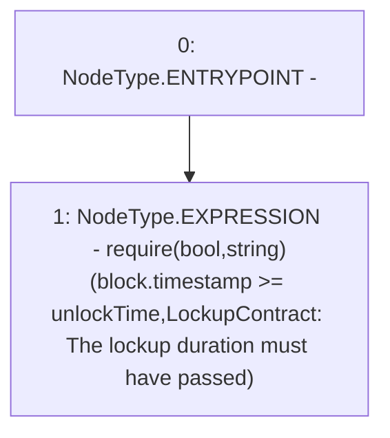

# Context: LockupContract._requireLockupDurationHasPassed

**Contract:** `LockupContract` (Inherits: None)
**Signature:** `_requireLockupDurationHasPassed()`
**Method Selector ID:** `Internal (No Method ID)`
**Visibility:** `internal`
**Environment-Free:** `No (reads EVM state context)`
**Modifiers:** None

### State Variables Interaction
- **Reads:** unlockTime
- **Writes:** None

### Assertion Checks & Business Requirements
- require/assert: `require(bool,string)(block.timestamp >= unlockTime,LockupContract: The lockup duration must have passed)`

### Environment & Verification Flags
- **Uses Foundry Cheatcodes:** No
- **Has Echidna Properties:** No

### Internal Calls Tree
- None

### External Calls / Value Transfers
- None

### Control Flow Graph (CFG)


### Source Mapping
Declared in: `certora-ac-datasets/detasets/web3bugs/dataset/web3bugs/66/packages/contracts/contracts/YETI/LockupContract.sol` on lines **73** to **75**

```solidity
    function _requireLockupDurationHasPassed() internal view {
        require(block.timestamp >= unlockTime, "LockupContract: The lockup duration must have passed");
    }

```
