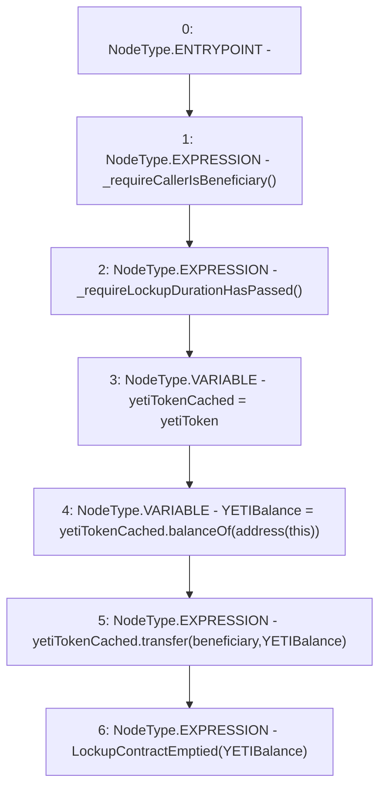

# Context: LockupContract.withdrawYETI

**Contract:** `LockupContract` (Inherits: None)
**Signature:** `withdrawYETI()`
**Method Selector ID:** `0xbdace15a`
**Visibility:** `external`
**Environment-Free:** `No (reads EVM state context)`
**Modifiers:** None

### State Variables Interaction
- **Reads:** beneficiary, yetiToken
- **Writes:** None

### Environment & Verification Flags
- **Uses Foundry Cheatcodes:** No
- **Has Echidna Properties:** No

### Internal Calls Tree
- None

### External Calls / Value Transfers
- `IYETIToken.TMP_39(uint256) = HIGH_LEVEL_CALL, dest:yetiTokenCached(IYETIToken), function:balanceOf, arguments:['TMP_38']  `
- `IYETIToken.TMP_40(bool) = HIGH_LEVEL_CALL, dest:yetiTokenCached(IYETIToken), function:transfer, arguments:['beneficiary', 'YETIBalance']  `

### Control Flow Graph (CFG)


### Source Mapping
Declared in: `certora-ac-datasets/detasets/web3bugs/dataset/web3bugs/66/packages/contracts/contracts/YETI/LockupContract.sol` on lines **57** to **65**

```solidity
    function withdrawYETI() external {
        _requireCallerIsBeneficiary();
        _requireLockupDurationHasPassed();

        IYETIToken yetiTokenCached = yetiToken;
        uint YETIBalance = yetiTokenCached.balanceOf(address(this));
        yetiTokenCached.transfer(beneficiary, YETIBalance);
        emit LockupContractEmptied(YETIBalance);
    }

```
