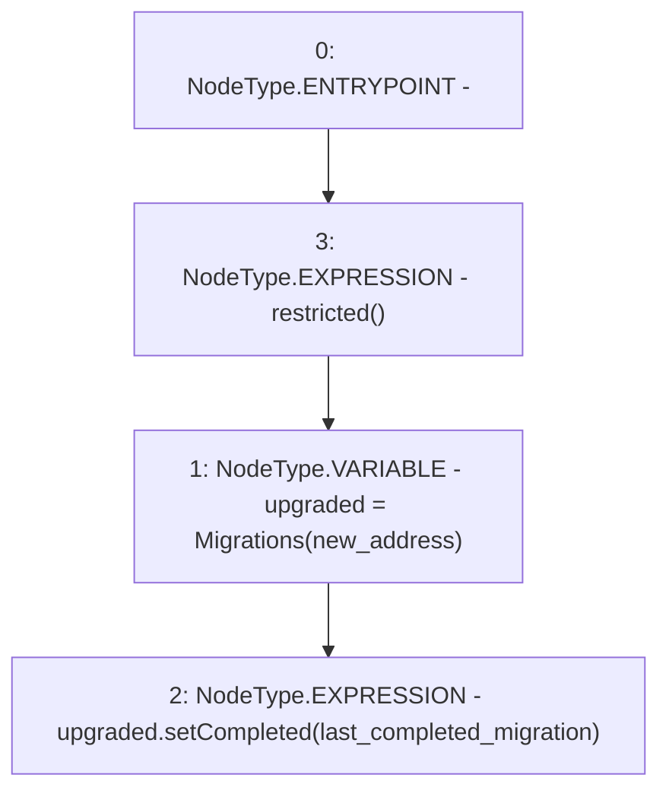

# Context: Migrations.upgrade

**Contract:** `Migrations` (Inherits: None)
**Signature:** `upgrade(address)`
**Method Selector ID:** `0x0900f010`
**Visibility:** `public`
**Environment-Free:** `No (reads EVM state context)`
**Modifiers:**
- `restricted`
  ```solidity
  modifier restricted() {
      if (msg.sender == owner) _;
    }
  ```

### State Variables Interaction
- **Reads:** last_completed_migration
- **Writes:** None

### Environment & Verification Flags
- **Uses Foundry Cheatcodes:** No
- **Has Echidna Properties:** No

### Internal Calls Tree
- None

### External Calls / Value Transfers
- `Migrations.HIGH_LEVEL_CALL, dest:upgraded(Migrations), function:setCompleted, arguments:['last_completed_migration']  `

### Control Flow Graph (CFG)


### Source Mapping
Declared in: `certora-ac-datasets/detasets/web3bugs/dataset/web3bugs/66/packages/contracts/contracts/Migrations.sol` on lines **21** to **24**

```solidity
  function upgrade(address new_address) public restricted {
    Migrations upgraded = Migrations(new_address);
    upgraded.setCompleted(last_completed_migration);
  }

```
