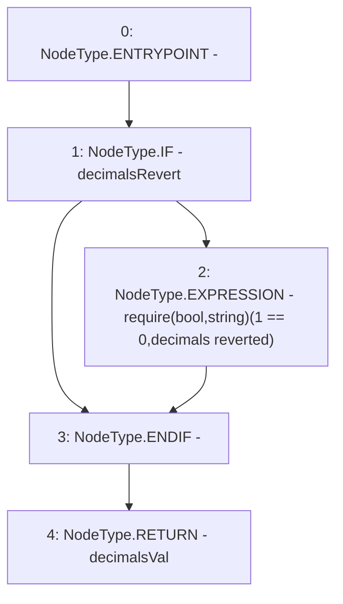

# Context: MockAggregator.decimals

**Contract:** `MockAggregator` (Inherits: AggregatorV3Interface)
**Signature:** `decimals() returns (uint8)`
**Method Selector ID:** `0x313ce567`
**Visibility:** `external`
**Environment-Free:** `Yes`
**Modifiers:** None

### State Variables Interaction
- **Reads:** decimalsRevert, decimalsVal
- **Writes:** None

### Assertion Checks & Business Requirements
- require/assert: `require(bool,string)(1 == 0,decimals reverted)`

### Environment & Verification Flags
- **Uses Foundry Cheatcodes:** No
- **Has Echidna Properties:** No

### Internal Calls Tree
- None

### External Calls / Value Transfers
- None

### Control Flow Graph (CFG)


### Source Mapping
Declared in: `certora-ac-datasets/detasets/web3bugs/dataset/web3bugs/66/packages/contracts/contracts/TestContracts/MockAggregator.sol` on lines **69** to **73**

```solidity
    function decimals() external override view returns (uint8) {
        if (decimalsRevert) {require(1== 0, "decimals reverted");}

        return decimalsVal;
    }

```
