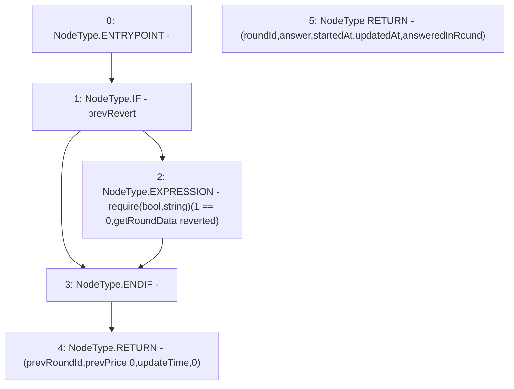

# Context: MockAggregator.getRoundData

**Contract:** `MockAggregator` (Inherits: AggregatorV3Interface)
**Signature:** `getRoundData(uint80) returns (uint80, int256, uint256, uint256, uint80)`
**Method Selector ID:** `0x9a6fc8f5`
**Visibility:** `external`
**Environment-Free:** `Yes`
**Modifiers:** None

### State Variables Interaction
- **Reads:** prevPrice, prevRevert, prevRoundId, updateTime
- **Writes:** None

### Assertion Checks & Business Requirements
- require/assert: `require(bool,string)(1 == 0,getRoundData reverted)`

### Environment & Verification Flags
- **Uses Foundry Cheatcodes:** No
- **Has Echidna Properties:** No

### Internal Calls Tree
- None

### External Calls / Value Transfers
- None

### Control Flow Graph (CFG)


### Source Mapping
Declared in: `certora-ac-datasets/detasets/web3bugs/dataset/web3bugs/66/packages/contracts/contracts/TestContracts/MockAggregator.sol` on lines **92** to **106**

```solidity
    function getRoundData(uint80)
    external
    override 
    view
    returns (
      uint80 roundId,
      int256 answer,
      uint256 startedAt,
      uint256 updatedAt,
      uint80 answeredInRound
    ) {
        if (prevRevert) {require( 1== 0, "getRoundData reverted");}

        return (prevRoundId, prevPrice, 0, updateTime, 0);
    }

```
