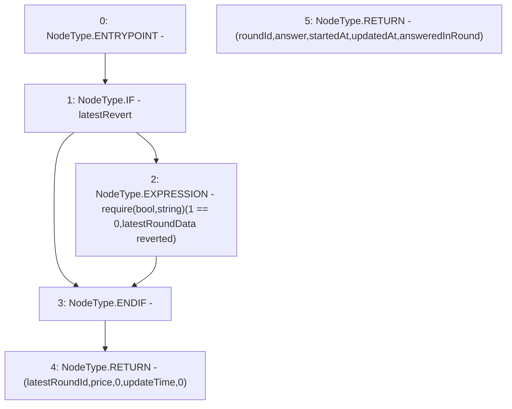

# Context: MockAggregator.latestRoundData

**Contract:** `MockAggregator` (Inherits: AggregatorV3Interface)
**Signature:** `latestRoundData() returns (uint80, int256, uint256, uint256, uint80)`
**Method Selector ID:** `0xfeaf968c`
**Visibility:** `external`
**Environment-Free:** `Yes`
**Modifiers:** None

### State Variables Interaction
- **Reads:** latestRevert, latestRoundId, price, updateTime
- **Writes:** None

### Assertion Checks & Business Requirements
- require/assert: `require(bool,string)(1 == 0,latestRoundData reverted)`

### Environment & Verification Flags
- **Uses Foundry Cheatcodes:** No
- **Has Echidna Properties:** No

### Internal Calls Tree
- None

### External Calls / Value Transfers
- None

### Control Flow Graph (CFG)


### Source Mapping
Declared in: `certora-ac-datasets/detasets/web3bugs/dataset/web3bugs/66/packages/contracts/contracts/TestContracts/MockAggregator.sol` on lines **75** to **90**

```solidity
    function latestRoundData()
        external
        override
        view
    returns (
        uint80 roundId,
        int256 answer,
        uint256 startedAt,
        uint256 updatedAt,
        uint80 answeredInRound
    ) 
    {    
        if (latestRevert) { require(1== 0, "latestRoundData reverted");}

        return (latestRoundId, price, 0, updateTime, 0); 
    }

```
