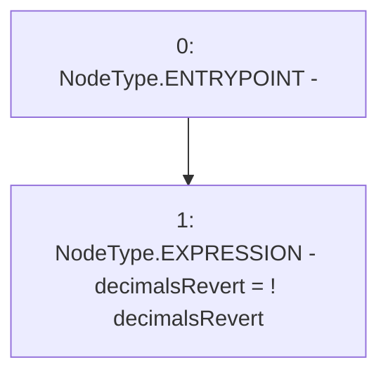

# Context: MockAggregator.setDecimalsRevert

**Contract:** `MockAggregator` (Inherits: AggregatorV3Interface)
**Signature:** `setDecimalsRevert()`
**Method Selector ID:** `0x29ccf0cf`
**Visibility:** `external`
**Environment-Free:** `Yes`
**Modifiers:** None

### State Variables Interaction
- **Reads:** decimalsRevert
- **Writes:** decimalsRevert

### Environment & Verification Flags
- **Uses Foundry Cheatcodes:** No
- **Has Echidna Properties:** No

### Internal Calls Tree
- None

### External Calls / Value Transfers
- None

### Control Flow Graph (CFG)


### Source Mapping
Declared in: `certora-ac-datasets/detasets/web3bugs/dataset/web3bugs/66/packages/contracts/contracts/TestContracts/MockAggregator.sol` on lines **54** to **56**

```solidity
    function setDecimalsRevert() external {
        decimalsRevert = !decimalsRevert;
    }

```
