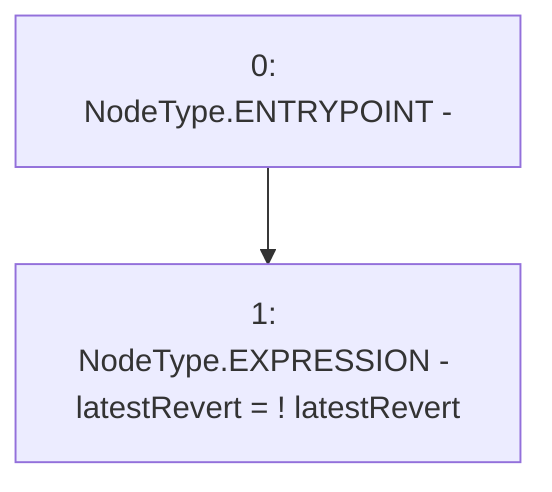

# Context: MockAggregator.setLatestRevert

**Contract:** `MockAggregator` (Inherits: AggregatorV3Interface)
**Signature:** `setLatestRevert()`
**Method Selector ID:** `0x66543a6c`
**Visibility:** `external`
**Environment-Free:** `Yes`
**Modifiers:** None

### State Variables Interaction
- **Reads:** latestRevert
- **Writes:** latestRevert

### Environment & Verification Flags
- **Uses Foundry Cheatcodes:** No
- **Has Echidna Properties:** No

### Internal Calls Tree
- None

### External Calls / Value Transfers
- None

### Control Flow Graph (CFG)


### Source Mapping
Declared in: `certora-ac-datasets/detasets/web3bugs/dataset/web3bugs/66/packages/contracts/contracts/TestContracts/MockAggregator.sol` on lines **46** to **48**

```solidity
    function setLatestRevert() external  {
        latestRevert = !latestRevert;
    }

```
