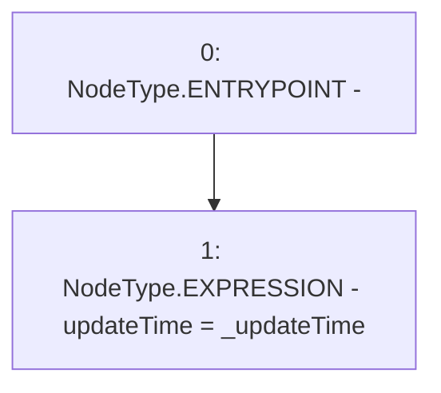

# Context: MockAggregator.setUpdateTime

**Contract:** `MockAggregator` (Inherits: AggregatorV3Interface)
**Signature:** `setUpdateTime(uint256)`
**Method Selector ID:** `0xbf73eea6`
**Visibility:** `external`
**Environment-Free:** `Yes`
**Modifiers:** None

### State Variables Interaction
- **Reads:** None
- **Writes:** updateTime

### Environment & Verification Flags
- **Uses Foundry Cheatcodes:** No
- **Has Echidna Properties:** No

### Internal Calls Tree
- None

### External Calls / Value Transfers
- None

### Control Flow Graph (CFG)


### Source Mapping
Declared in: `certora-ac-datasets/detasets/web3bugs/dataset/web3bugs/66/packages/contracts/contracts/TestContracts/MockAggregator.sol` on lines **42** to **44**

```solidity
    function setUpdateTime(uint _updateTime) external  {
        updateTime = _updateTime;
    }

```
