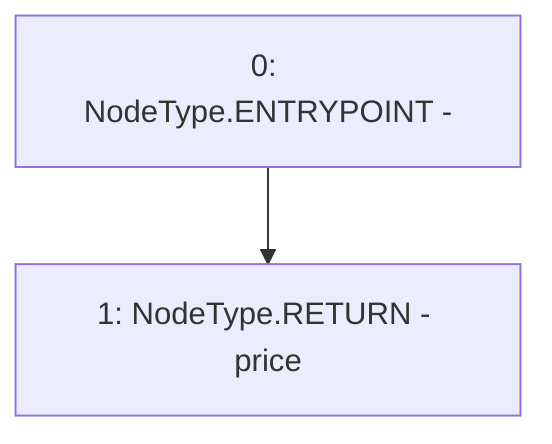

# Context: MockTellor.retrieveData

**Contract:** `MockTellor` (Inherits: None)
**Signature:** `retrieveData(uint256,uint256) returns (uint256)`
**Method Selector ID:** `0x93fa4915`
**Visibility:** `external`
**Environment-Free:** `Yes`
**Modifiers:** None

### State Variables Interaction
- **Reads:** price
- **Writes:** None

### Environment & Verification Flags
- **Uses Foundry Cheatcodes:** No
- **Has Echidna Properties:** No

### Internal Calls Tree
- None

### External Calls / Value Transfers
- None

### Control Flow Graph (CFG)


### Source Mapping
Declared in: `certora-ac-datasets/detasets/web3bugs/dataset/web3bugs/66/packages/contracts/contracts/TestContracts/MockTellor.sol` on lines **45** to **47**

```solidity
    function retrieveData(uint256, uint256) external view returns (uint256) {
        return price;
    }

```
