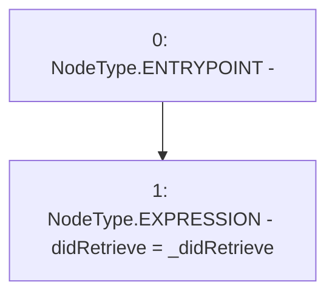

# Context: MockTellor.setDidRetrieve

**Contract:** `MockTellor` (Inherits: None)
**Signature:** `setDidRetrieve(bool)`
**Method Selector ID:** `0xc4954857`
**Visibility:** `external`
**Environment-Free:** `Yes`
**Modifiers:** None

### State Variables Interaction
- **Reads:** None
- **Writes:** didRetrieve

### Environment & Verification Flags
- **Uses Foundry Cheatcodes:** No
- **Has Echidna Properties:** No

### Internal Calls Tree
- None

### External Calls / Value Transfers
- None

### Control Flow Graph (CFG)


### Source Mapping
Declared in: `certora-ac-datasets/detasets/web3bugs/dataset/web3bugs/66/packages/contracts/contracts/TestContracts/MockTellor.sol` on lines **22** to **24**

```solidity
      function setDidRetrieve(bool _didRetrieve) external {
        didRetrieve = _didRetrieve;
    }

```
