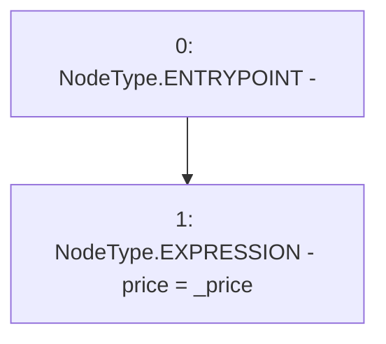

# Context: MockTellor.setPrice

**Contract:** `MockTellor` (Inherits: None)
**Signature:** `setPrice(uint256)`
**Method Selector ID:** `0x91b7f5ed`
**Visibility:** `external`
**Environment-Free:** `Yes`
**Modifiers:** None

### State Variables Interaction
- **Reads:** None
- **Writes:** price

### Environment & Verification Flags
- **Uses Foundry Cheatcodes:** No
- **Has Echidna Properties:** No

### Internal Calls Tree
- None

### External Calls / Value Transfers
- None

### Control Flow Graph (CFG)


### Source Mapping
Declared in: `certora-ac-datasets/detasets/web3bugs/dataset/web3bugs/66/packages/contracts/contracts/TestContracts/MockTellor.sol` on lines **18** to **20**

```solidity
    function setPrice(uint _price) external {
        price = _price;
    }

```
