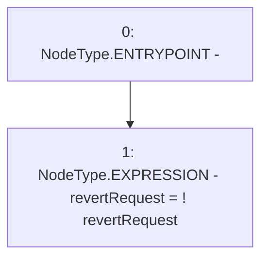

# Context: MockTellor.setRevertRequest

**Contract:** `MockTellor` (Inherits: None)
**Signature:** `setRevertRequest()`
**Method Selector ID:** `0x2fc0eb85`
**Visibility:** `external`
**Environment-Free:** `Yes`
**Modifiers:** None

### State Variables Interaction
- **Reads:** revertRequest
- **Writes:** revertRequest

### Assertion Checks & Business Requirements
- revert: `revertRequest = ! revertRequest`

### Environment & Verification Flags
- **Uses Foundry Cheatcodes:** No
- **Has Echidna Properties:** No

### Internal Calls Tree
- None

### External Calls / Value Transfers
- None

### Control Flow Graph (CFG)


### Source Mapping
Declared in: `certora-ac-datasets/detasets/web3bugs/dataset/web3bugs/66/packages/contracts/contracts/TestContracts/MockTellor.sol` on lines **30** to **32**

```solidity
      function setRevertRequest() external {
        revertRequest = !revertRequest;
    }

```
