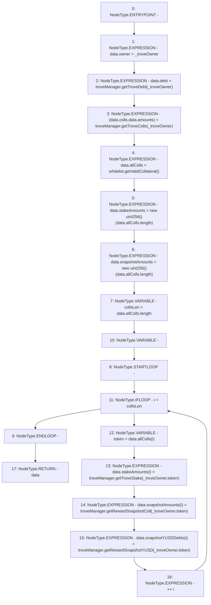

# Context: MultiTroveGetter._getCombinedTroveData

**Contract:** `MultiTroveGetter` (Inherits: None)
**Signature:** `_getCombinedTroveData(address) returns (MultiTroveGetter.CombinedTroveData)`
**Method Selector ID:** `Internal (No Method ID)`
**Visibility:** `internal`
**Environment-Free:** `Yes`
**Modifiers:** None

### State Variables Interaction
- **Reads:** troveManager, whitelist
- **Writes:** None

### Environment & Verification Flags
- **Uses Foundry Cheatcodes:** No
- **Has Echidna Properties:** No

### Internal Calls Tree
- None

### External Calls / Value Transfers
- `IWhitelist.TMP_469(address[]) = HIGH_LEVEL_CALL, dest:whitelist(IWhitelist), function:getValidCollateral, arguments:[]  `
- `TroveManager.TMP_476(uint256) = HIGH_LEVEL_CALL, dest:troveManager(TroveManager), function:getRewardSnapshotColl, arguments:['_troveOwner', 'token']  `
- `TroveManager.TUPLE_1(address[],uint256[]) = HIGH_LEVEL_CALL, dest:troveManager(TroveManager), function:getTroveColls, arguments:['_troveOwner']  `
- `TroveManager.TMP_475(uint256) = HIGH_LEVEL_CALL, dest:troveManager(TroveManager), function:getTroveStake, arguments:['_troveOwner', 'token']  `
- `TroveManager.TMP_468(uint256) = HIGH_LEVEL_CALL, dest:troveManager(TroveManager), function:getTroveDebt, arguments:['_troveOwner']  `
- `TroveManager.TMP_477(uint256) = HIGH_LEVEL_CALL, dest:troveManager(TroveManager), function:getRewardSnapshotYUSD, arguments:['_troveOwner', 'token']  `

### Control Flow Graph (CFG)


### Source Mapping
Declared in: `certora-ac-datasets/detasets/web3bugs/dataset/web3bugs/66/packages/contracts/contracts/MultiTroveGetter.sol` on lines **102** to **118**

```solidity
    function _getCombinedTroveData(address _troveOwner) internal view returns (CombinedTroveData memory data) {
        data.owner = _troveOwner;
        data.debt = troveManager.getTroveDebt(_troveOwner);
        (data.colls, data.amounts) = troveManager.getTroveColls(_troveOwner);

        data.allColls = whitelist.getValidCollateral();
        data.stakeAmounts = new uint[](data.allColls.length);
        data.snapshotAmounts = new uint[](data.allColls.length);
        uint256 collsLen = data.allColls.length;
        for (uint256 i; i < collsLen; ++i) {
            address token = data.allColls[i];

            data.stakeAmounts[i] = troveManager.getTroveStake(_troveOwner, token);
            data.snapshotAmounts[i] = troveManager.getRewardSnapshotColl(_troveOwner, token);
            data.snapshotYUSDDebts[i] = troveManager.getRewardSnapshotYUSD(_troveOwner, token);
        }
    }

```
