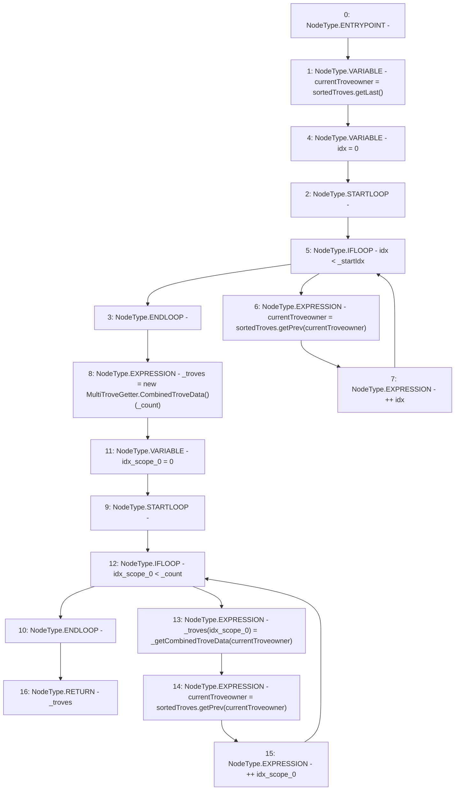

# Context: MultiTroveGetter._getMultipleSortedTrovesFromTail

**Contract:** `MultiTroveGetter` (Inherits: None)
**Signature:** `_getMultipleSortedTrovesFromTail(uint256,uint256) returns (MultiTroveGetter.CombinedTroveData[])`
**Method Selector ID:** `Internal (No Method ID)`
**Visibility:** `internal`
**Environment-Free:** `Yes`
**Modifiers:** None

### State Variables Interaction
- **Reads:** sortedTroves
- **Writes:** None

### Environment & Verification Flags
- **Uses Foundry Cheatcodes:** No
- **Has Echidna Properties:** No

### Internal Calls Tree
- None

### External Calls / Value Transfers
- `ISortedTroves.TMP_467(address) = HIGH_LEVEL_CALL, dest:sortedTroves(ISortedTroves), function:getPrev, arguments:['currentTroveowner']  `
- `ISortedTroves.TMP_460(address) = HIGH_LEVEL_CALL, dest:sortedTroves(ISortedTroves), function:getLast, arguments:[]  `
- `ISortedTroves.TMP_462(address) = HIGH_LEVEL_CALL, dest:sortedTroves(ISortedTroves), function:getPrev, arguments:['currentTroveowner']  `

### Control Flow Graph (CFG)


### Source Mapping
Declared in: `certora-ac-datasets/detasets/web3bugs/dataset/web3bugs/66/packages/contracts/contracts/MultiTroveGetter.sol` on lines **85** to **100**

```solidity
    function _getMultipleSortedTrovesFromTail(uint _startIdx, uint _count)
        internal view returns (CombinedTroveData[] memory _troves)
    {
        address currentTroveowner = sortedTroves.getLast();

        for (uint idx = 0; idx < _startIdx; ++idx) {
            currentTroveowner = sortedTroves.getPrev(currentTroveowner);
        }

        _troves = new CombinedTroveData[](_count);

        for (uint idx = 0; idx < _count; ++idx) {
            _troves[idx] = _getCombinedTroveData(currentTroveowner);
            currentTroveowner = sortedTroves.getPrev(currentTroveowner);
        }
    }

```
