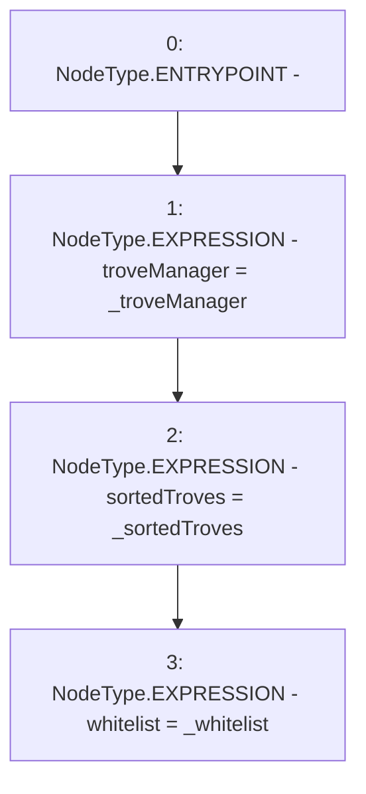

# Context: MultiTroveGetter.constructor

**Contract:** `MultiTroveGetter` (Inherits: None)
**Signature:** `constructor(TroveManager,ISortedTroves,IWhitelist)`
**Method Selector ID:** `0x6dd23b5b`
**Visibility:** `public`
**Environment-Free:** `Yes`
**Modifiers:** None

### State Variables Interaction
- **Reads:** None
- **Writes:** sortedTroves, troveManager, whitelist

### Environment & Verification Flags
- **Uses Foundry Cheatcodes:** No
- **Has Echidna Properties:** No

### Internal Calls Tree
- None

### External Calls / Value Transfers
- None

### Control Flow Graph (CFG)


### Source Mapping
Declared in: `certora-ac-datasets/detasets/web3bugs/dataset/web3bugs/66/packages/contracts/contracts/MultiTroveGetter.sol` on lines **29** to **33**

```solidity
    constructor(TroveManager _troveManager, ISortedTroves _sortedTroves, IWhitelist _whitelist) public {
        troveManager = _troveManager;
        sortedTroves = _sortedTroves;
        whitelist = _whitelist;
    }

```
