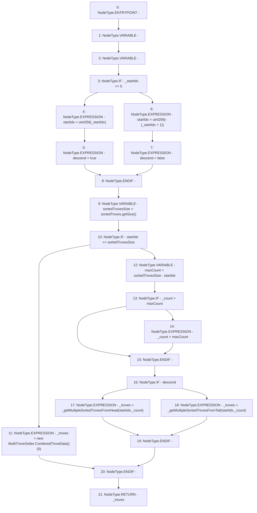

# Context: MultiTroveGetter.getMultipleSortedTroves

**Contract:** `MultiTroveGetter` (Inherits: None)
**Signature:** `getMultipleSortedTroves(int256,uint256) returns (MultiTroveGetter.CombinedTroveData[])`
**Method Selector ID:** `0xb90bce45`
**Visibility:** `external`
**Environment-Free:** `Yes`
**Modifiers:** None

### State Variables Interaction
- **Reads:** sortedTroves
- **Writes:** None

### Environment & Verification Flags
- **Uses Foundry Cheatcodes:** No
- **Has Echidna Properties:** No

### Internal Calls Tree
- None

### External Calls / Value Transfers
- `ISortedTroves.TMP_444(uint256) = HIGH_LEVEL_CALL, dest:sortedTroves(ISortedTroves), function:getSize, arguments:[]  `

### Control Flow Graph (CFG)


### Source Mapping
Declared in: `certora-ac-datasets/detasets/web3bugs/dataset/web3bugs/66/packages/contracts/contracts/MultiTroveGetter.sol` on lines **35** to **66**

```solidity
    function getMultipleSortedTroves(int _startIdx, uint _count)
        external view returns (CombinedTroveData[] memory _troves)
    {
        uint startIdx;
        bool descend;

        if (_startIdx >= 0) {
            startIdx = uint(_startIdx);
            descend = true;
        } else {
            startIdx = uint(-(_startIdx + 1));
            descend = false;
        }

        uint sortedTrovesSize = sortedTroves.getSize();

        if (startIdx >= sortedTrovesSize) {
            _troves = new CombinedTroveData[](0);
        } else {
            uint maxCount = sortedTrovesSize - startIdx;

            if (_count > maxCount) {
                _count = maxCount;
            }

            if (descend) {
                _troves = _getMultipleSortedTrovesFromHead(startIdx, _count);
            } else {
                _troves = _getMultipleSortedTrovesFromTail(startIdx, _count);
            }
        }
    }

```
