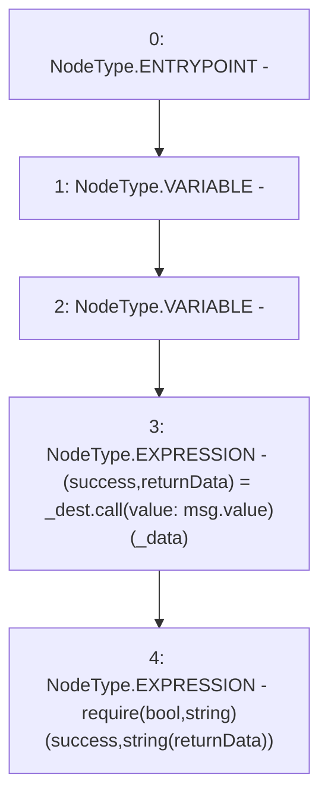

# Context: NonPayable.forward

**Contract:** `NonPayable` (Inherits: None)
**Signature:** `forward(address,bytes)`
**Method Selector ID:** `0x6fadcf72`
**Visibility:** `external`
**Environment-Free:** `No (reads EVM state context)`
**Modifiers:** None

### State Variables Interaction
- **Reads:** None
- **Writes:** None

### Assertion Checks & Business Requirements
- require/assert: `require(bool,string)(success,string(returnData))`

### Environment & Verification Flags
- **Uses Foundry Cheatcodes:** No
- **Has Echidna Properties:** No

### Internal Calls Tree
- None

### External Calls / Value Transfers
- `low-level-call`

### Control Flow Graph (CFG)


### Source Mapping
Declared in: `certora-ac-datasets/detasets/web3bugs/dataset/web3bugs/66/packages/contracts/contracts/TestContracts/NonPayable.sol` on lines **15** to **18**

```solidity
    function forward(address _dest, bytes calldata _data) external payable {
        (bool success, bytes memory returnData) = _dest.call{ value: msg.value }(_data);
        require(success, string(returnData));
    }

```
