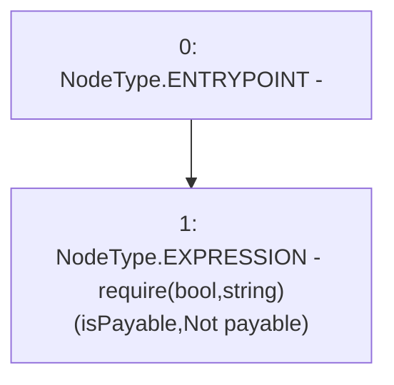

# Context: NonPayable.receive

**Contract:** `NonPayable` (Inherits: None)
**Signature:** `receive()`
**Method Selector ID:** `0xa3e76c0f`
**Visibility:** `external`
**Environment-Free:** `Yes`
**Modifiers:** None

### State Variables Interaction
- **Reads:** isPayable
- **Writes:** None

### Assertion Checks & Business Requirements
- require/assert: `require(bool,string)(isPayable,Not payable)`

### Environment & Verification Flags
- **Uses Foundry Cheatcodes:** No
- **Has Echidna Properties:** No

### Internal Calls Tree
- None

### External Calls / Value Transfers
- None

### Control Flow Graph (CFG)


### Source Mapping
Declared in: `certora-ac-datasets/detasets/web3bugs/dataset/web3bugs/66/packages/contracts/contracts/TestContracts/NonPayable.sol` on lines **20** to **22**

```solidity
    receive() external payable {
        require(isPayable, "Not payable");
    }

```
