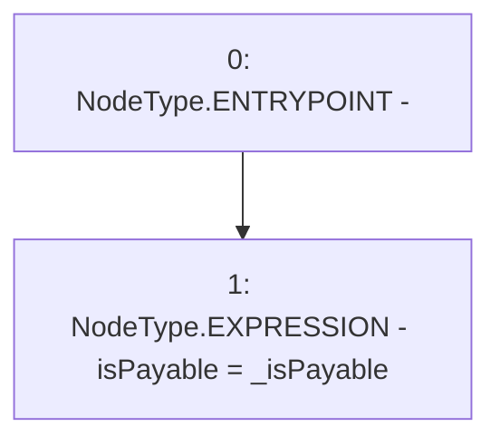

# Context: NonPayable.setPayable

**Contract:** `NonPayable` (Inherits: None)
**Signature:** `setPayable(bool)`
**Method Selector ID:** `0xf124a300`
**Visibility:** `external`
**Environment-Free:** `Yes`
**Modifiers:** None

### State Variables Interaction
- **Reads:** None
- **Writes:** isPayable

### Environment & Verification Flags
- **Uses Foundry Cheatcodes:** No
- **Has Echidna Properties:** No

### Internal Calls Tree
- None

### External Calls / Value Transfers
- None

### Control Flow Graph (CFG)


### Source Mapping
Declared in: `certora-ac-datasets/detasets/web3bugs/dataset/web3bugs/66/packages/contracts/contracts/TestContracts/NonPayable.sol` on lines **11** to **13**

```solidity
    function setPayable(bool _isPayable) external {
        isPayable = _isPayable;
    }

```
