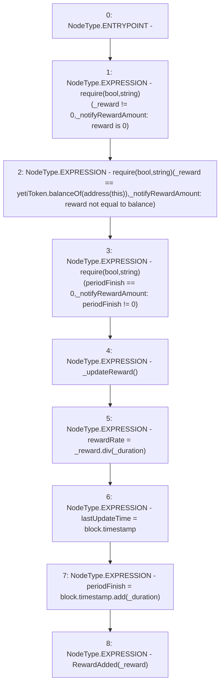

# Context: Pool2Unipool._notifyRewardAmount

**Contract:** `Pool2Unipool` (Inherits: IUnipool, CheckContract, Ownable, LPTokenWrapper, ILPTokenWrapper)
**Signature:** `_notifyRewardAmount(uint256,uint256)`
**Method Selector ID:** `Internal (No Method ID)`
**Visibility:** `internal`
**Environment-Free:** `No (reads EVM state context)`
**Modifiers:** None

### State Variables Interaction
- **Reads:** periodFinish, yetiToken
- **Writes:** lastUpdateTime, periodFinish, rewardRate

### Assertion Checks & Business Requirements
- require/assert: `require(bool,string)(_reward != 0,_notifyRewardAmount: reward is 0)`
- require/assert: `require(bool,string)(_reward == yetiToken.balanceOf(address(this)),_notifyRewardAmount: reward not equal to balance)`
- require/assert: `require(bool,string)(periodFinish == 0,_notifyRewardAmount: periodFinish != 0)`

### Environment & Verification Flags
- **Uses Foundry Cheatcodes:** No
- **Has Echidna Properties:** No

### Internal Calls Tree
- None

### External Calls / Value Transfers
- `IYETIToken.TMP_203(uint256) = HIGH_LEVEL_CALL, dest:yetiToken(IYETIToken), function:balanceOf, arguments:['TMP_202']  `
- `SafeMath.TMP_210(uint256) = LIBRARY_CALL, dest:SafeMath, function:SafeMath.add(uint256,uint256), arguments:['block.timestamp', '_duration'] `
- `SafeMath.TMP_209(uint256) = LIBRARY_CALL, dest:SafeMath, function:SafeMath.div(uint256,uint256), arguments:['_reward', '_duration'] `

### Control Flow Graph (CFG)


### Source Mapping
Declared in: `certora-ac-datasets/detasets/web3bugs/dataset/web3bugs/66/packages/contracts/contracts/LPRewards/Pool2Unipool.sol` on lines **212** to **224**

```solidity
    function _notifyRewardAmount(uint256 _reward, uint256 _duration) internal {
        require(_reward != 0, "_notifyRewardAmount: reward is 0");
        require(_reward == yetiToken.balanceOf(address(this)), "_notifyRewardAmount: reward not equal to balance");
        require(periodFinish == 0, "_notifyRewardAmount: periodFinish != 0");

        _updateReward();

        rewardRate = _reward.div(_duration);

        lastUpdateTime = block.timestamp;
        periodFinish = block.timestamp.add(_duration);
        emit RewardAdded(_reward);
    }

```
