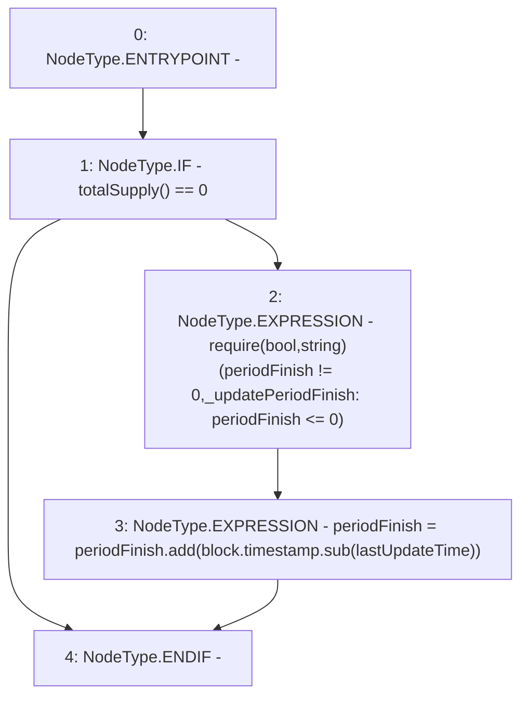

# Context: Pool2Unipool._updatePeriodFinish

**Contract:** `Pool2Unipool` (Inherits: IUnipool, CheckContract, Ownable, LPTokenWrapper, ILPTokenWrapper)
**Signature:** `_updatePeriodFinish()`
**Method Selector ID:** `Internal (No Method ID)`
**Visibility:** `internal`
**Environment-Free:** `No (reads EVM state context)`
**Modifiers:** None

### State Variables Interaction
- **Reads:** lastUpdateTime, periodFinish
- **Writes:** periodFinish

### Assertion Checks & Business Requirements
- require/assert: `require(bool,string)(periodFinish != 0,_updatePeriodFinish: periodFinish <= 0)`

### Environment & Verification Flags
- **Uses Foundry Cheatcodes:** No
- **Has Echidna Properties:** No

### Internal Calls Tree
- None

### External Calls / Value Transfers
- `SafeMath.TMP_216(uint256) = LIBRARY_CALL, dest:SafeMath, function:SafeMath.sub(uint256,uint256), arguments:['block.timestamp', 'lastUpdateTime'] `
- `SafeMath.TMP_217(uint256) = LIBRARY_CALL, dest:SafeMath, function:SafeMath.add(uint256,uint256), arguments:['periodFinish', 'TMP_216'] `

### Control Flow Graph (CFG)


### Source Mapping
Declared in: `certora-ac-datasets/detasets/web3bugs/dataset/web3bugs/66/packages/contracts/contracts/LPRewards/Pool2Unipool.sol` on lines **227** to **246**

```solidity
    function _updatePeriodFinish() internal {
        if (totalSupply() == 0) {
            require(periodFinish != 0, "_updatePeriodFinish: periodFinish <= 0");
            /*
             * If the finish period has been reached (but there are remaining rewards due to zero stake),
             * to get the new finish date we must add to the current timestamp the difference between
             * the original finish time and the last update, i.e.:
             *
             * periodFinish = block.timestamp.add(periodFinish.sub(lastUpdateTime));
             *
             * If we have not reached the end yet, we must extend it by adding to it the difference between
             * the current timestamp and the last update (the period where the supply has been empty), i.e.:
             *
             * periodFinish = periodFinish.add(block.timestamp.sub(lastUpdateTime));
             *
             * Both formulas are equivalent.
             */
            periodFinish = periodFinish.add(block.timestamp.sub(lastUpdateTime));
        }
    }

```
