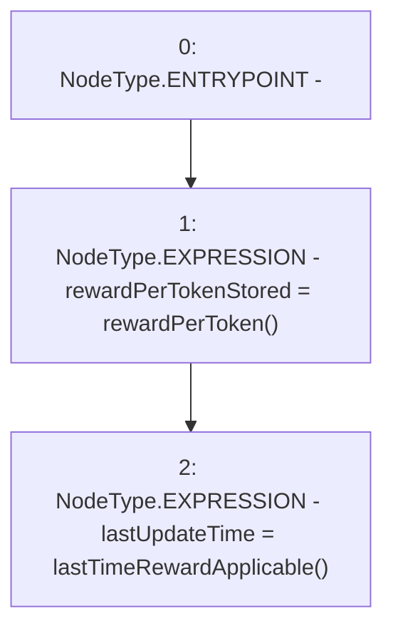

# Context: Pool2Unipool._updateReward

**Contract:** `Pool2Unipool` (Inherits: IUnipool, CheckContract, Ownable, LPTokenWrapper, ILPTokenWrapper)
**Signature:** `_updateReward()`
**Method Selector ID:** `Internal (No Method ID)`
**Visibility:** `internal`
**Environment-Free:** `No (reads EVM state context)`
**Modifiers:** None

### State Variables Interaction
- **Reads:** None
- **Writes:** lastUpdateTime, rewardPerTokenStored

### Environment & Verification Flags
- **Uses Foundry Cheatcodes:** No
- **Has Echidna Properties:** No

### Internal Calls Tree
- None

### External Calls / Value Transfers
- None

### Control Flow Graph (CFG)


### Source Mapping
Declared in: `certora-ac-datasets/detasets/web3bugs/dataset/web3bugs/66/packages/contracts/contracts/LPRewards/Pool2Unipool.sol` on lines **248** to **251**

```solidity
    function _updateReward() internal {
        rewardPerTokenStored = rewardPerToken();
        lastUpdateTime = lastTimeRewardApplicable();
    }

```
