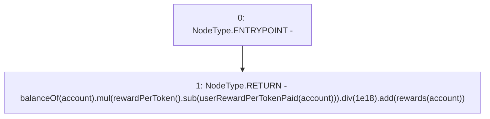

# Context: Pool2Unipool.earned

**Contract:** `Pool2Unipool` (Inherits: IUnipool, CheckContract, Ownable, LPTokenWrapper, ILPTokenWrapper)
**Signature:** `earned(address) returns (uint256)`
**Method Selector ID:** `0x008cc262`
**Visibility:** `public`
**Environment-Free:** `No (reads EVM state context)`
**Modifiers:** None

### State Variables Interaction
- **Reads:** rewards, userRewardPerTokenPaid
- **Writes:** None

### Environment & Verification Flags
- **Uses Foundry Cheatcodes:** No
- **Has Echidna Properties:** No

### Internal Calls Tree
- None

### External Calls / Value Transfers
- `SafeMath.TMP_164(uint256) = LIBRARY_CALL, dest:SafeMath, function:SafeMath.mul(uint256,uint256), arguments:['TMP_161', 'TMP_163'] `
- `SafeMath.TMP_166(uint256) = LIBRARY_CALL, dest:SafeMath, function:SafeMath.add(uint256,uint256), arguments:['TMP_165', 'REF_75'] `
- `SafeMath.TMP_163(uint256) = LIBRARY_CALL, dest:SafeMath, function:SafeMath.sub(uint256,uint256), arguments:['TMP_162', 'REF_72'] `
- `SafeMath.TMP_165(uint256) = LIBRARY_CALL, dest:SafeMath, function:SafeMath.div(uint256,uint256), arguments:['TMP_164', '1000000000000000000'] `

### Control Flow Graph (CFG)


### Source Mapping
Declared in: `certora-ac-datasets/detasets/web3bugs/dataset/web3bugs/66/packages/contracts/contracts/LPRewards/Pool2Unipool.sol` on lines **158** to **164**

```solidity
    function earned(address account) public view override returns (uint256) {
        return
            balanceOf(account)
                .mul(rewardPerToken().sub(userRewardPerTokenPaid[account]))
                .div(1e18)
                .add(rewards[account]);
    }

```
