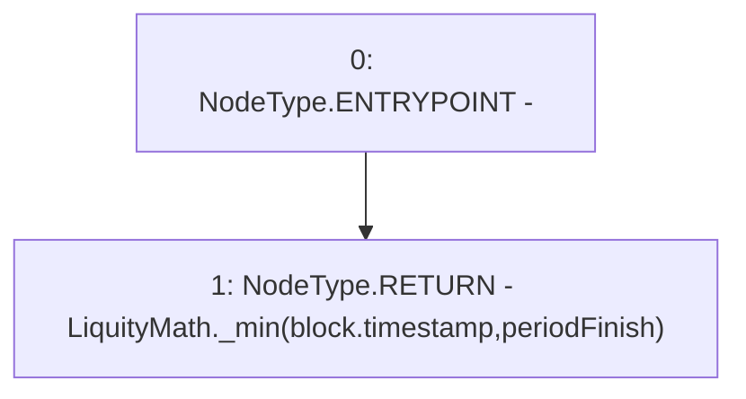

# Context: Pool2Unipool.lastTimeRewardApplicable

**Contract:** `Pool2Unipool` (Inherits: IUnipool, CheckContract, Ownable, LPTokenWrapper, ILPTokenWrapper)
**Signature:** `lastTimeRewardApplicable() returns (uint256)`
**Method Selector ID:** `0x80faa57d`
**Visibility:** `public`
**Environment-Free:** `No (reads EVM state context)`
**Modifiers:** None

### State Variables Interaction
- **Reads:** periodFinish
- **Writes:** None

### Environment & Verification Flags
- **Uses Foundry Cheatcodes:** No
- **Has Echidna Properties:** No

### Internal Calls Tree
- None

### External Calls / Value Transfers
- `LiquityMath.TMP_151(uint256) = LIBRARY_CALL, dest:LiquityMath, function:LiquityMath._min(uint256,uint256), arguments:['block.timestamp', 'periodFinish'] `

### Control Flow Graph (CFG)


### Source Mapping
Declared in: `certora-ac-datasets/detasets/web3bugs/dataset/web3bugs/66/packages/contracts/contracts/LPRewards/Pool2Unipool.sol` on lines **138** to **140**

```solidity
    function lastTimeRewardApplicable() public view override returns (uint256) {
        return LiquityMath._min(block.timestamp, periodFinish);
    }

```
