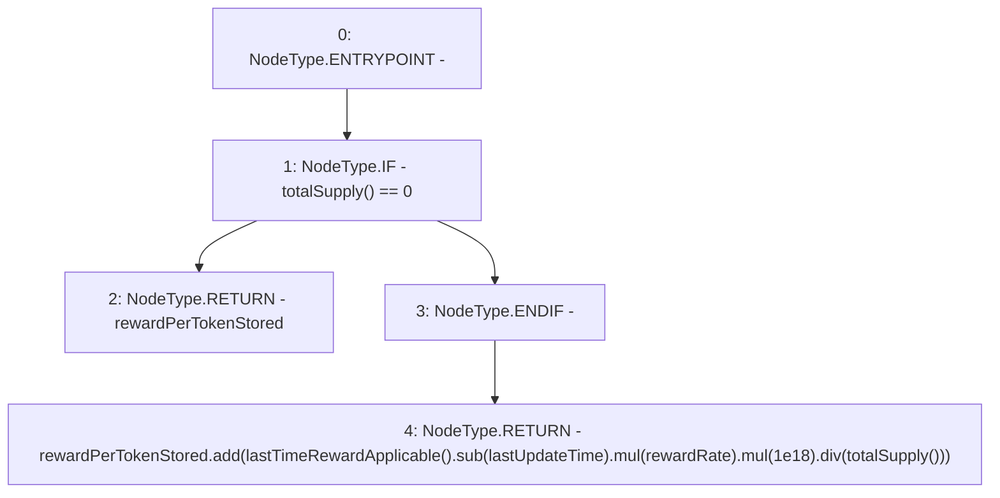

# Context: Pool2Unipool.rewardPerToken

**Contract:** `Pool2Unipool` (Inherits: IUnipool, CheckContract, Ownable, LPTokenWrapper, ILPTokenWrapper)
**Signature:** `rewardPerToken() returns (uint256)`
**Method Selector ID:** `0xcd3daf9d`
**Visibility:** `public`
**Environment-Free:** `No (reads EVM state context)`
**Modifiers:** None

### State Variables Interaction
- **Reads:** lastUpdateTime, rewardPerTokenStored, rewardRate
- **Writes:** None

### Environment & Verification Flags
- **Uses Foundry Cheatcodes:** No
- **Has Echidna Properties:** No

### Internal Calls Tree
- None

### External Calls / Value Transfers
- `SafeMath.TMP_156(uint256) = LIBRARY_CALL, dest:SafeMath, function:SafeMath.mul(uint256,uint256), arguments:['TMP_155', 'rewardRate'] `
- `SafeMath.TMP_160(uint256) = LIBRARY_CALL, dest:SafeMath, function:SafeMath.add(uint256,uint256), arguments:['rewardPerTokenStored', 'TMP_159'] `
- `SafeMath.TMP_157(uint256) = LIBRARY_CALL, dest:SafeMath, function:SafeMath.mul(uint256,uint256), arguments:['TMP_156', '1000000000000000000'] `
- `SafeMath.TMP_159(uint256) = LIBRARY_CALL, dest:SafeMath, function:SafeMath.div(uint256,uint256), arguments:['TMP_157', 'TMP_158'] `
- `SafeMath.TMP_155(uint256) = LIBRARY_CALL, dest:SafeMath, function:SafeMath.sub(uint256,uint256), arguments:['TMP_154', 'lastUpdateTime'] `

### Control Flow Graph (CFG)


### Source Mapping
Declared in: `certora-ac-datasets/detasets/web3bugs/dataset/web3bugs/66/packages/contracts/contracts/LPRewards/Pool2Unipool.sol` on lines **143** to **155**

```solidity
    function rewardPerToken() public view override returns (uint256) {
        if (totalSupply() == 0) {
            return rewardPerTokenStored;
        }
        return
            rewardPerTokenStored.add(
                lastTimeRewardApplicable()
                    .sub(lastUpdateTime)
                    .mul(rewardRate)
                    .mul(1e18)
                    .div(totalSupply())
            );
    }

```
