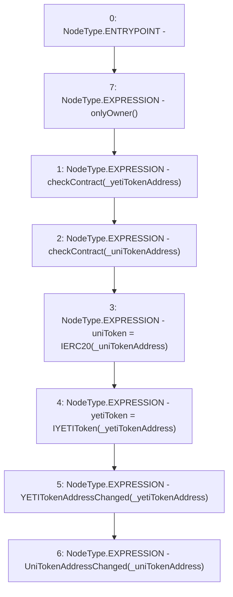

# Context: Pool2Unipool.setParams

**Contract:** `Pool2Unipool` (Inherits: IUnipool, CheckContract, Ownable, LPTokenWrapper, ILPTokenWrapper)
**Signature:** `setParams(address,address,uint256)`
**Method Selector ID:** `0x509db2f6`
**Visibility:** `external`
**Environment-Free:** `No (reads EVM state context)`
**Modifiers:**
- `onlyOwner`
  ```solidity
  modifier onlyOwner() {
          require(isOwner(), "CallerNotOwner");
          _;
      }
  ```

### State Variables Interaction
- **Reads:** None
- **Writes:** uniToken, yetiToken

### Environment & Verification Flags
- **Uses Foundry Cheatcodes:** No
- **Has Echidna Properties:** No

### Internal Calls Tree
- None

### External Calls / Value Transfers
- None

### Control Flow Graph (CFG)


### Source Mapping
Declared in: `certora-ac-datasets/detasets/web3bugs/dataset/web3bugs/66/packages/contracts/contracts/LPRewards/Pool2Unipool.sol` on lines **95** to **120**

```solidity
    function setParams(
        address _yetiTokenAddress,
        address _uniTokenAddress,
        uint _duration
    )
        external
        override
        onlyOwner
    {
        checkContract(_yetiTokenAddress);
        checkContract(_uniTokenAddress);

        uniToken = IERC20(_uniTokenAddress);
        yetiToken = IYETIToken(_yetiTokenAddress);
        //duration = _duration;

        // This function must be commented out as it assumes an allocation already exists
        // for this pool immediately after creation. 
        //_notifyRewardAmount(yetiToken.getLpRewardsEntitlement(), _duration);

        emit YETITokenAddressChanged(_yetiTokenAddress);
        emit UniTokenAddressChanged(_uniTokenAddress);

        // this must be done in setReward
        //_renounceOwnership();
    }

```
