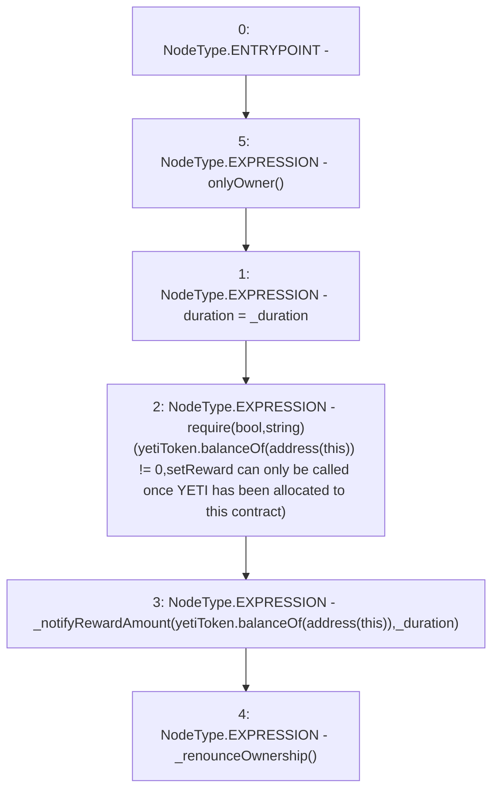

# Context: Pool2Unipool.setReward

**Contract:** `Pool2Unipool` (Inherits: IUnipool, CheckContract, Ownable, LPTokenWrapper, ILPTokenWrapper)
**Signature:** `setReward(uint256)`
**Method Selector ID:** `0x293be456`
**Visibility:** `external`
**Environment-Free:** `No (reads EVM state context)`
**Modifiers:**
- `onlyOwner`
  ```solidity
  modifier onlyOwner() {
          require(isOwner(), "CallerNotOwner");
          _;
      }
  ```

### State Variables Interaction
- **Reads:** yetiToken
- **Writes:** duration

### Assertion Checks & Business Requirements
- require/assert: `require(bool,string)(yetiToken.balanceOf(address(this)) != 0,setReward can only be called once YETI has been allocated to this contract)`

### Environment & Verification Flags
- **Uses Foundry Cheatcodes:** No
- **Has Echidna Properties:** No

### Internal Calls Tree
- None

### External Calls / Value Transfers
- `IYETIToken.TMP_143(uint256) = HIGH_LEVEL_CALL, dest:yetiToken(IYETIToken), function:balanceOf, arguments:['TMP_142']  `
- `IYETIToken.TMP_147(uint256) = HIGH_LEVEL_CALL, dest:yetiToken(IYETIToken), function:balanceOf, arguments:['TMP_146']  `

### Control Flow Graph (CFG)


### Source Mapping
Declared in: `certora-ac-datasets/detasets/web3bugs/dataset/web3bugs/66/packages/contracts/contracts/LPRewards/Pool2Unipool.sol` on lines **123** to **135**

```solidity
    function setReward(
        uint _duration
    )
        external
        onlyOwner
    {
        duration = _duration;
        require(yetiToken.balanceOf(address(this)) != 0, "setReward can only be called once YETI has been allocated to this contract");
        // This function must be commented out as it assumes an allocation already exists
        // for this pool immediately after creation. 
        _notifyRewardAmount(yetiToken.balanceOf(address(this)), _duration);
        _renounceOwnership();
    }

```
