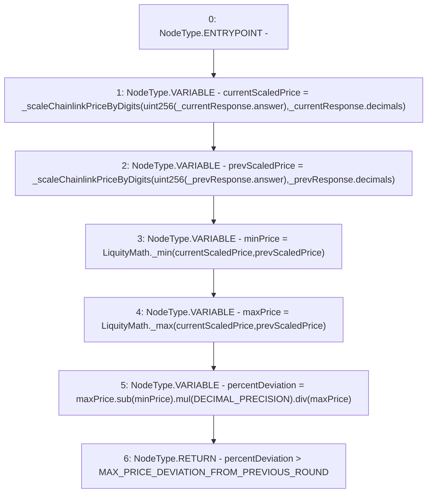

# Context: PriceFeedTester._chainlinkPriceChangeAboveMax

**Contract:** `PriceFeedTester` (Inherits: PriceFeed, IPriceFeed, BaseMath, CheckContract, Ownable)
**Signature:** `_chainlinkPriceChangeAboveMax(PriceFeed.ChainlinkResponse,PriceFeed.ChainlinkResponse) returns (bool)`
**Method Selector ID:** `Internal (No Method ID)`
**Visibility:** `internal`
**Environment-Free:** `Yes`
**Modifiers:** None

### State Variables Interaction
- **Reads:** DECIMAL_PRECISION, MAX_PRICE_DEVIATION_FROM_PREVIOUS_ROUND
- **Writes:** None

### Environment & Verification Flags
- **Uses Foundry Cheatcodes:** No
- **Has Echidna Properties:** No

### Internal Calls Tree
- None

### External Calls / Value Transfers
- `SafeMath.TMP_445(uint256) = LIBRARY_CALL, dest:SafeMath, function:SafeMath.div(uint256,uint256), arguments:['TMP_444', 'maxPrice'] `
- `SafeMath.TMP_443(uint256) = LIBRARY_CALL, dest:SafeMath, function:SafeMath.sub(uint256,uint256), arguments:['maxPrice', 'minPrice'] `
- `LiquityMath.TMP_441(uint256) = LIBRARY_CALL, dest:LiquityMath, function:LiquityMath._min(uint256,uint256), arguments:['currentScaledPrice', 'prevScaledPrice'] `
- `SafeMath.TMP_444(uint256) = LIBRARY_CALL, dest:SafeMath, function:SafeMath.mul(uint256,uint256), arguments:['TMP_443', 'DECIMAL_PRECISION'] `
- `LiquityMath.TMP_442(uint256) = LIBRARY_CALL, dest:LiquityMath, function:LiquityMath._max(uint256,uint256), arguments:['currentScaledPrice', 'prevScaledPrice'] `

### Control Flow Graph (CFG)


### Source Mapping
Declared in: `certora-ac-datasets/detasets/web3bugs/dataset/web3bugs/66/packages/contracts/contracts/PriceFeed.sol` on lines **595** to **611**

```solidity
    function _chainlinkPriceChangeAboveMax(ChainlinkResponse memory _currentResponse, ChainlinkResponse memory _prevResponse) internal pure returns (bool) {
        uint currentScaledPrice = _scaleChainlinkPriceByDigits(uint256(_currentResponse.answer), _currentResponse.decimals);
        uint prevScaledPrice = _scaleChainlinkPriceByDigits(uint256(_prevResponse.answer), _prevResponse.decimals);

        uint minPrice = LiquityMath._min(currentScaledPrice, prevScaledPrice);
        uint maxPrice = LiquityMath._max(currentScaledPrice, prevScaledPrice);

        /*
        * Use the larger price as the denominator:
        * - If price decreased, the percentage deviation is in relation to the the previous price.
        * - If price increased, the percentage deviation is in relation to the current price.
        */
        uint percentDeviation = maxPrice.sub(minPrice).mul(DECIMAL_PRECISION).div(maxPrice);

        // Return true if price has more than doubled, or more than halved.
        return percentDeviation > MAX_PRICE_DEVIATION_FROM_PREVIOUS_ROUND;
    }

```
