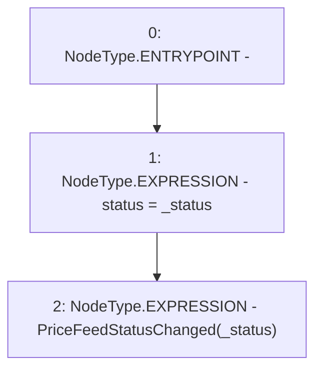

# Context: PriceFeedTester._changeStatus

**Contract:** `PriceFeedTester` (Inherits: PriceFeed, IPriceFeed, BaseMath, CheckContract, Ownable)
**Signature:** `_changeStatus(PriceFeed.Status)`
**Method Selector ID:** `Internal (No Method ID)`
**Visibility:** `internal`
**Environment-Free:** `Yes`
**Modifiers:** None

### State Variables Interaction
- **Reads:** None
- **Writes:** status

### Environment & Verification Flags
- **Uses Foundry Cheatcodes:** No
- **Has Echidna Properties:** No

### Internal Calls Tree
- None

### External Calls / Value Transfers
- None

### Control Flow Graph (CFG)


### Source Mapping
Declared in: `certora-ac-datasets/detasets/web3bugs/dataset/web3bugs/66/packages/contracts/contracts/PriceFeed.sol` on lines **692** to **695**

```solidity
    function _changeStatus(Status _status) internal {
        status = _status;
        emit PriceFeedStatusChanged(_status);
    }

```
