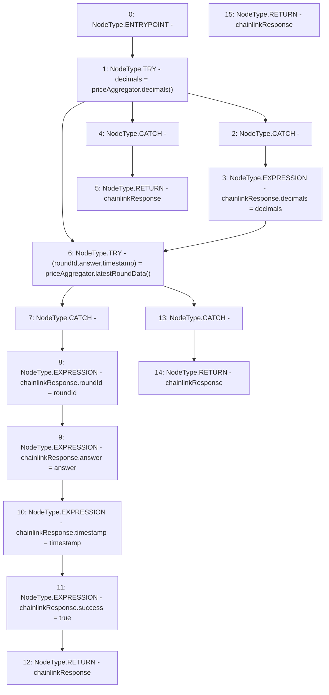

# Context: PriceFeedTester._getCurrentChainlinkResponse

**Contract:** `PriceFeedTester` (Inherits: PriceFeed, IPriceFeed, BaseMath, CheckContract, Ownable)
**Signature:** `_getCurrentChainlinkResponse() returns (PriceFeed.ChainlinkResponse)`
**Method Selector ID:** `Internal (No Method ID)`
**Visibility:** `internal`
**Environment-Free:** `Yes`
**Modifiers:** None

### State Variables Interaction
- **Reads:** priceAggregator
- **Writes:** None

### Environment & Verification Flags
- **Uses Foundry Cheatcodes:** No
- **Has Echidna Properties:** No

### Internal Calls Tree
- None

### External Calls / Value Transfers
- `AggregatorV3Interface.TUPLE_4(uint80,int256,uint256,uint256,uint80) = HIGH_LEVEL_CALL, dest:priceAggregator(AggregatorV3Interface), function:latestRoundData, arguments:[]  `
- `AggregatorV3Interface.TMP_489(uint8) = HIGH_LEVEL_CALL, dest:priceAggregator(AggregatorV3Interface), function:decimals, arguments:[]  `

### Control Flow Graph (CFG)


### Source Mapping
Declared in: `certora-ac-datasets/detasets/web3bugs/dataset/web3bugs/66/packages/contracts/contracts/PriceFeed.sol` on lines **739** to **769**

```solidity
    function _getCurrentChainlinkResponse() internal view returns (ChainlinkResponse memory chainlinkResponse) {
        // First, try to get current decimal precision:
        try priceAggregator.decimals() returns (uint8 decimals) {
            // If call to Chainlink succeeds, record the current decimal precision
            chainlinkResponse.decimals = decimals;
        } catch {
            // If call to Chainlink aggregator reverts, return a zero response with success = false
            return chainlinkResponse;
        }

        // Secondly, try to get latest price data:
        try priceAggregator.latestRoundData() returns
        (
            uint80 roundId,
            int256 answer,
            uint256 /* startedAt */,
            uint256 timestamp,
            uint80 /* answeredInRound */
        )
        {
            // If call to Chainlink succeeds, return the response and success = true
            chainlinkResponse.roundId = roundId;
            chainlinkResponse.answer = answer;
            chainlinkResponse.timestamp = timestamp;
            chainlinkResponse.success = true;
            return chainlinkResponse;
        } catch {
            // If call to Chainlink aggregator reverts, return a zero response with success = false
            return chainlinkResponse;
        }
    }

```
