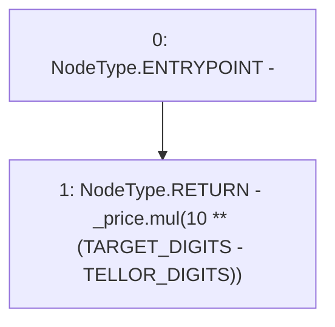

# Context: PriceFeedTester._scaleTellorPriceByDigits

**Contract:** `PriceFeedTester` (Inherits: PriceFeed, IPriceFeed, BaseMath, CheckContract, Ownable)
**Signature:** `_scaleTellorPriceByDigits(uint256) returns (uint256)`
**Method Selector ID:** `Internal (No Method ID)`
**Visibility:** `internal`
**Environment-Free:** `Yes`
**Modifiers:** None

### State Variables Interaction
- **Reads:** TARGET_DIGITS, TELLOR_DIGITS
- **Writes:** None

### Environment & Verification Flags
- **Uses Foundry Cheatcodes:** No
- **Has Echidna Properties:** No

### Internal Calls Tree
- None

### External Calls / Value Transfers
- `SafeMath.TMP_481(uint256) = LIBRARY_CALL, dest:SafeMath, function:SafeMath.mul(uint256,uint256), arguments:['_price', 'TMP_480'] `

### Control Flow Graph (CFG)


### Source Mapping
Declared in: `certora-ac-datasets/detasets/web3bugs/dataset/web3bugs/66/packages/contracts/contracts/PriceFeed.sol` on lines **688** to **690**

```solidity
    function _scaleTellorPriceByDigits(uint _price) internal pure returns (uint) {
        return _price.mul(10**(TARGET_DIGITS - TELLOR_DIGITS));
    }

```
